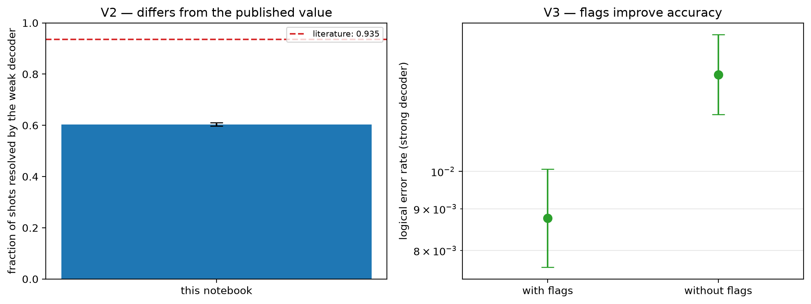

# E0 validation — [[72, 12, 6]], T=6, p=0.001

Data file: `E0_72-12-6_T6_p0.001_22600shots.json`  
Exported: 2026-09-23T21:10:22

Literature source: Pakhunov (2026), Table II, [[72,12,6]], p=1e-3, T=12

## Table: checks

[checks.csv](checks.csv) — 4 rows

| check | value | detail |
|---|---|---|
| V1 fault-model density | 10.0× | 15,840 faults vs 1,584 from n(wT + T/2 + 1) |
| V2 reproduces literature | no | ours 0.603 [0.597, 0.610] vs 0.935 (Pakhunov (2026), Table II, [[72,12,6]], p=1e-3, T=12) |
| V3 cost of flags | flags improve accuracy | LER 8.76e-03 with flags vs 1.31e-02 without; +1,296 faults, +216 detectors; flags fire on 67.7% of shots |
| silent failures (weak decoder) | 0 flagged / 0 unflagged | the only failures a flag trigger could ever catch |

## Figure: validation

  
Vector version: [validation.pdf](validation.pdf)
