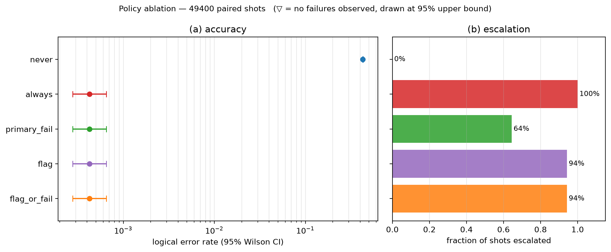
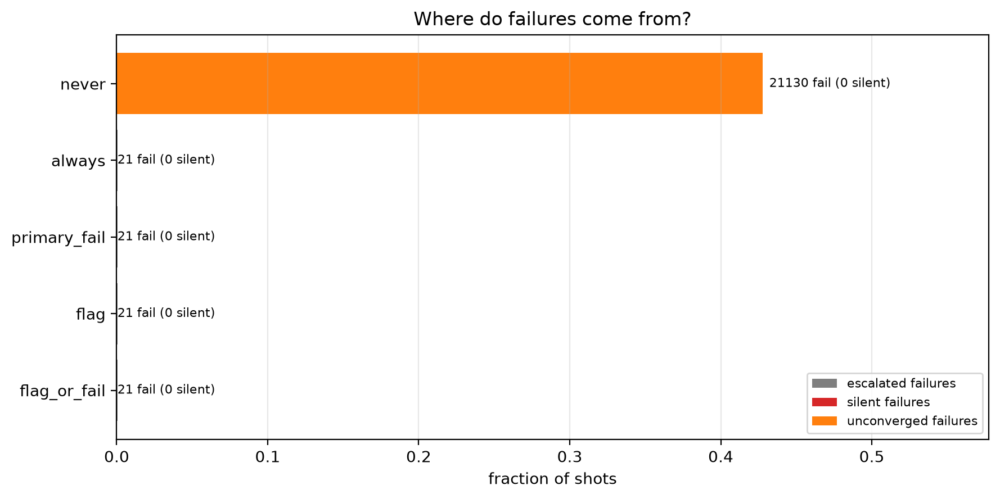
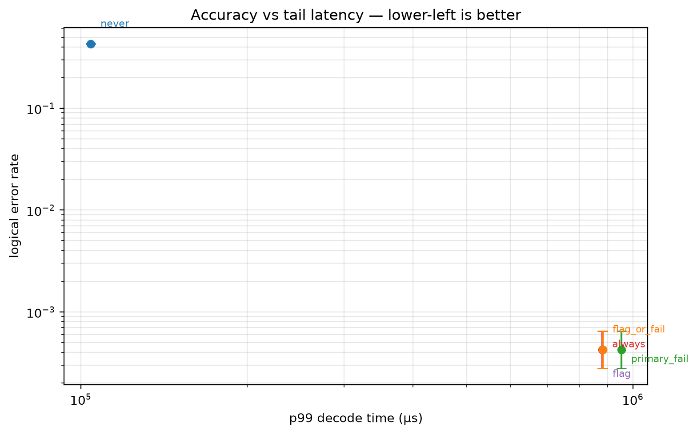
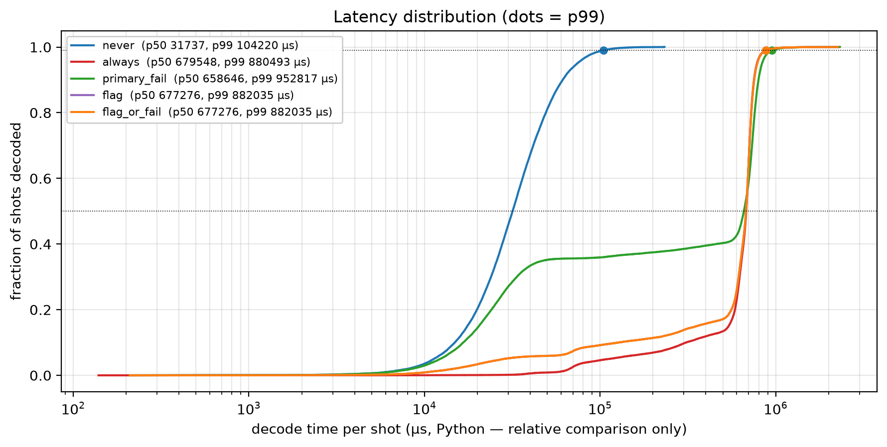

# E1 — [[144, 12, 12]], T=6, p=0.001, 49400 shots

Data file: `E1_144-12-12_T6_p0.001_49400shots_seed20260921_flags_osd0.json`  
Exported: 2026-09-23T20:16:41

## Table: metrics

[metrics.csv](metrics.csv) — 5 rows

| code | rounds | p | shots | seed | use_flags | osd_order | workers | policy | failures | ler | ci_low | ci_high | escalation_rate | silent_failures | unconverged_failures | escalated_failures | work_mean | work_p99 | time_p50_us | time_p99_us |
|---|---|---|---|---|---|---|---|---|---|---|---|---|---|---|---|---|---|---|---|---|
| [[144, 12, 12]] | 6 | 0.001 | 49400 | 20260921 | True | 0 | 12 | never | 21130 | 0.4277 | 0.4234 | 0.4321 | 0 | 0 | 21130 | 0 | 35.87 | 84 | 3.174e+04 | 1.042e+05 |
| [[144, 12, 12]] | 6 | 0.001 | 49400 | 20260921 | True | 0 | 12 | always | 21 | 0.0004251 | 0.0002781 | 0.0006498 | 1 | 0 | 0 | 21 | 18.64 | 20 | 6.795e+05 | 8.805e+05 |
| [[144, 12, 12]] | 6 | 0.001 | 49400 | 20260921 | True | 0 | 12 | primary_fail | 21 | 0.0004251 | 0.0002781 | 0.0006498 | 0.6444 | 0 | 0 | 21 | 48.43 | 104 | 6.586e+05 | 9.528e+05 |
| [[144, 12, 12]] | 6 | 0.001 | 49400 | 20260921 | True | 0 | 12 | flag | 21 | 0.0004251 | 0.0002781 | 0.0006498 | 0.9422 | 0 | 0 | 21 | 20.3 | 60 | 6.773e+05 | 8.82e+05 |
| [[144, 12, 12]] | 6 | 0.001 | 49400 | 20260921 | True | 0 | 12 | flag_or_fail | 21 | 0.0004251 | 0.0002781 | 0.0006498 | 0.9422 | 0 | 0 | 21 | 20.3 | 60 | 6.773e+05 | 8.82e+05 |

## Figure: ablation

  
Vector version: [ablation.pdf](ablation.pdf)

## Figure: outcomes

  
Vector version: [outcomes.pdf](outcomes.pdf)

## Figure: tradeoff

  
Vector version: [tradeoff.pdf](tradeoff.pdf)

## Figure: latency

  
Vector version: [latency.pdf](latency.pdf)
