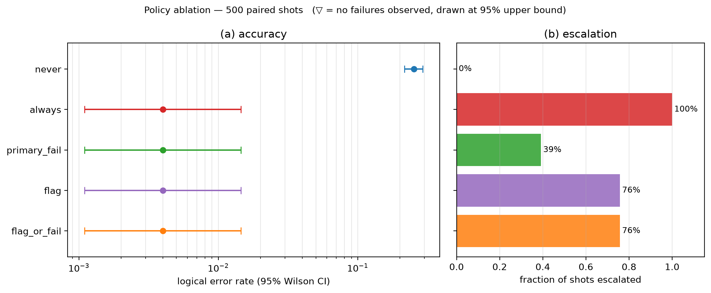
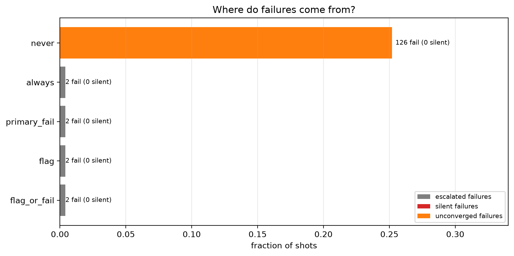
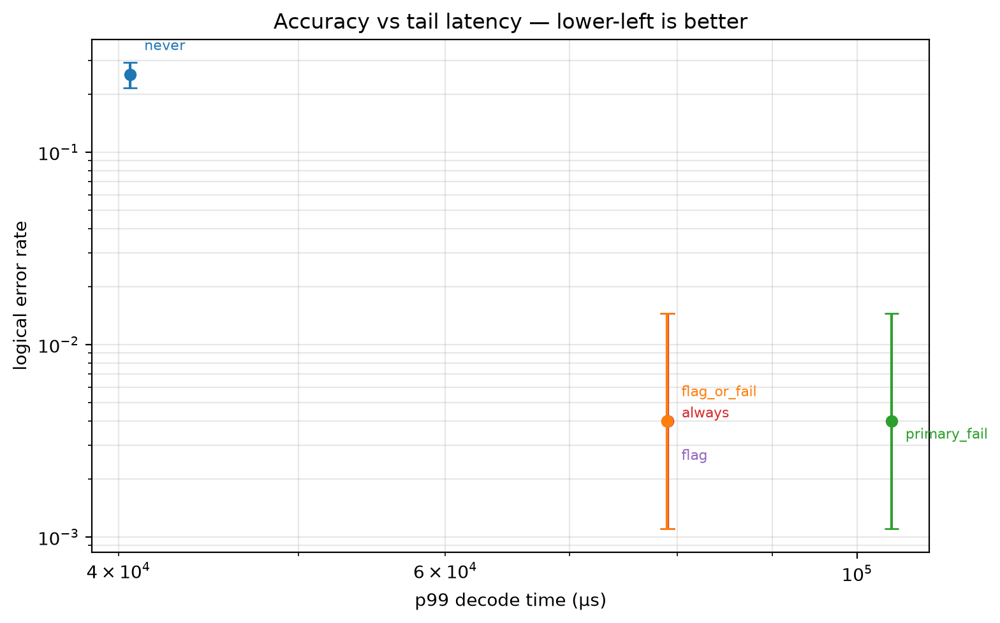
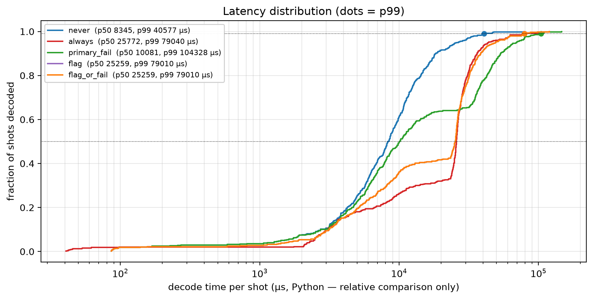

# E1 — [[72, 12, 6]], T=6, p=0.001, 500 shots

Data file: `E1_72-12-6_T6_p0.001_500shots_seed20260921_flags_osd0.json`  
Exported: 2026-09-23T01:25:17

## Table: metrics

[metrics.csv](metrics.csv) — 5 rows

| code | rounds | p | shots | seed | use_flags | osd_order | workers | policy | failures | ler | ci_low | ci_high | escalation_rate | silent_failures | unconverged_failures | escalated_failures | work_mean | work_p99 | time_p50_us | time_p99_us |
|---|---|---|---|---|---|---|---|---|---|---|---|---|---|---|---|---|---|---|---|---|
| [[72, 12, 6]] | 6 | 0.001 | 500 | 20260921 | True | 0 | 12 | never | 126 | 0.252 | 0.2159 | 0.2918 | 0 | 0 | 126 | 0 | 17.77 | 55.06 | 8345 | 4.058e+04 |
| [[72, 12, 6]] | 6 | 0.001 | 500 | 20260921 | True | 0 | 12 | always | 2 | 0.004 | 0.001098 | 0.01447 | 1 | 0 | 0 | 2 | 15.5 | 20 | 2.577e+04 | 7.904e+04 |
| [[72, 12, 6]] | 6 | 0.001 | 500 | 20260921 | True | 0 | 12 | primary_fail | 2 | 0.004 | 0.001098 | 0.01447 | 0.392 | 0 | 0 | 2 | 25.06 | 75.06 | 1.008e+04 | 1.043e+05 |
| [[72, 12, 6]] | 6 | 0.001 | 500 | 20260921 | True | 0 | 12 | flag | 2 | 0.004 | 0.001098 | 0.01447 | 0.758 | 0 | 0 | 2 | 16.21 | 49.03 | 2.526e+04 | 7.901e+04 |
| [[72, 12, 6]] | 6 | 0.001 | 500 | 20260921 | True | 0 | 12 | flag_or_fail | 2 | 0.004 | 0.001098 | 0.01447 | 0.758 | 0 | 0 | 2 | 16.21 | 49.03 | 2.526e+04 | 7.901e+04 |

## Figure: ablation

  
Vector version: [ablation.pdf](ablation.pdf)

## Figure: outcomes

  
Vector version: [outcomes.pdf](outcomes.pdf)

## Figure: tradeoff

  
Vector version: [tradeoff.pdf](tradeoff.pdf)

## Figure: latency

  
Vector version: [latency.pdf](latency.pdf)
