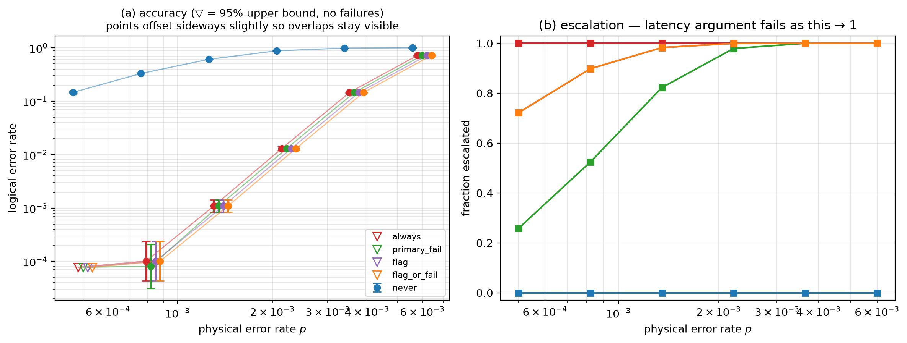

# E2 — [[144, 12, 12]], T=6, 49400 shots/point

Data file: `E2_144-12-12_T6_p0.001_49400shots_seed20260921_flags_osd0.json`  
Exported: 2026-09-23T20:31:15

## Table: sweep_metrics

[sweep_metrics.csv](sweep_metrics.csv) — 30 rows

| p | policy | shots | failures | ler | ci_low | ci_high | escalation_rate | silent_failures | unconverged_failures | escalated_failures | work_mean | work_p99 | time_p50_us | time_p99_us |
|---|---|---|---|---|---|---|---|---|---|---|---|---|---|---|
| 0.0005 | never | 49400 | 7248 | 0.1467 | 0.1436 | 0.1499 | 0 | 0 | 7248 | 0 | 17.21 | 50 | 1.532e+04 | 6.72e+04 |
| 0.0005 | always | 49400 | 0 | 0 | 0 | 7.776e-05 | 1 | 0 | 0 | 0 | 14.81 | 20 | 6.04e+05 | 7.96e+05 |
| 0.0005 | primary_fail | 49400 | 0 | 0 | 0 | 7.776e-05 | 0.2585 | 0 | 0 | 0 | 22.04 | 70 | 1.701e+04 | 8.188e+05 |
| 0.0005 | flag | 49400 | 0 | 0 | 0 | 7.776e-05 | 0.7218 | 0 | 0 | 0 | 15.71 | 48 | 5.254e+05 | 7.966e+05 |
| 0.0005 | flag_or_fail | 49400 | 0 | 0 | 0 | 7.776e-05 | 0.7218 | 0 | 0 | 0 | 15.71 | 48 | 5.254e+05 | 7.966e+05 |
| 0.0008219 | never | 49400 | 16316 | 0.3303 | 0.3261 | 0.3344 | 0 | 0 | 16316 | 0 | 29.14 | 72 | 2.548e+04 | 8.911e+04 |
| 0.0008219 | always | 49400 | 5 | 0.0001012 | 4.323e-05 | 0.0002369 | 1 | 0 | 0 | 5 | 17.82 | 20 | 6.344e+05 | 8.235e+05 |
| 0.0008219 | primary_fail | 49400 | 4 | 8.097e-05 | 3.149e-05 | 0.0002082 | 0.524 | 0 | 0 | 4 | 39.25 | 92 | 2.327e+05 | 8.756e+05 |
| 0.0008219 | flag | 49400 | 5 | 0.0001012 | 4.323e-05 | 0.0002369 | 0.8978 | 0 | 0 | 5 | 19.56 | 57 | 6.299e+05 | 8.244e+05 |
| 0.0008219 | flag_or_fail | 49400 | 5 | 0.0001012 | 4.323e-05 | 0.0002369 | 0.8978 | 0 | 0 | 5 | 19.56 | 57 | 6.299e+05 | 8.244e+05 |
| 0.001351 | never | 49400 | 30075 | 0.6088 | 0.6045 | 0.6131 | 0 | 0 | 30075 | 0 | 49.82 | 105 | 4.349e+04 | 1.231e+05 |
| 0.001351 | always | 49400 | 54 | 0.001093 | 0.000838 | 0.001426 | 1 | 0 | 0 | 54 | 19.37 | 20 | 6.281e+05 | 9.176e+05 |
| 0.001351 | primary_fail | 49400 | 54 | 0.001093 | 0.000838 | 0.001426 | 0.8228 | 0 | 0 | 54 | 66.05 | 125 | 6.586e+05 | 9.973e+05 |
| 0.001351 | flag | 49400 | 54 | 0.001093 | 0.000838 | 0.001426 | 0.9828 | 0 | 0 | 54 | 20.73 | 64 | 6.282e+05 | 9.183e+05 |
| 0.001351 | flag_or_fail | 49400 | 54 | 0.001093 | 0.000838 | 0.001426 | 0.9828 | 0 | 0 | 54 | 20.73 | 64 | 6.282e+05 | 9.183e+05 |
| 0.002221 | never | 49400 | 43399 | 0.8785 | 0.8756 | 0.8814 | 0 | 0 | 43399 | 0 | 85.41 | 155 | 6.849e+04 | 1.509e+05 |
| 0.002221 | always | 49400 | 642 | 0.013 | 0.01203 | 0.01403 | 1 | 0 | 0 | 642 | 19.95 | 20 | 5.43e+05 | 1.464e+06 |
| 0.002221 | primary_fail | 49400 | 642 | 0.013 | 0.01203 | 0.01403 | 0.9793 | 0 | 0 | 642 | 105 | 175 | 6.096e+05 | 1.568e+06 |
| 0.002221 | flag | 49400 | 642 | 0.013 | 0.01203 | 0.01403 | 0.9994 | 0 | 0 | 642 | 20.35 | 20 | 5.433e+05 | 1.464e+06 |
| 0.002221 | flag_or_fail | 49400 | 642 | 0.013 | 0.01203 | 0.01403 | 0.9994 | 0 | 0 | 642 | 20.35 | 20 | 5.433e+05 | 1.464e+06 |
| 0.00365 | never | 49400 | 48761 | 0.9871 | 0.986 | 0.988 | 0 | 0 | 48761 | 0 | 143.2 | 223 | 9.916e+04 | 1.736e+05 |
| 0.00365 | always | 49400 | 7224 | 0.1462 | 0.1431 | 0.1494 | 1 | 0 | 0 | 7224 | 20 | 20 | 3.909e+05 | 2.41e+06 |
| 0.00365 | primary_fail | 49400 | 7224 | 0.1462 | 0.1431 | 0.1494 | 0.9997 | 0 | 0 | 7224 | 163.2 | 243 | 4.917e+05 | 2.531e+06 |
| 0.00365 | flag | 49400 | 7224 | 0.1462 | 0.1431 | 0.1494 | 1 | 0 | 0 | 7224 | 20.04 | 20 | 3.909e+05 | 2.41e+06 |
| 0.00365 | flag_or_fail | 49400 | 7224 | 0.1462 | 0.1431 | 0.1494 | 1 | 0 | 0 | 7224 | 20.04 | 20 | 3.909e+05 | 2.41e+06 |
| 0.006 | never | 49400 | 49369 | 0.9994 | 0.9991 | 0.9996 | 0 | 0 | 49369 | 0 | 225.1 | 310 | 1.283e+05 | 1.897e+05 |
| 0.006 | always | 49400 | 35480 | 0.7182 | 0.7142 | 0.7222 | 1 | 0 | 0 | 35480 | 20 | 20 | 1.618e+06 | 4.035e+06 |
| 0.006 | primary_fail | 49400 | 35480 | 0.7182 | 0.7142 | 0.7222 | 1 | 0 | 0 | 35480 | 245.1 | 330 | 1.748e+06 | 4.173e+06 |
| 0.006 | flag | 49400 | 35480 | 0.7182 | 0.7142 | 0.7222 | 1 | 0 | 0 | 35480 | 20 | 20 | 1.618e+06 | 4.035e+06 |
| 0.006 | flag_or_fail | 49400 | 35480 | 0.7182 | 0.7142 | 0.7222 | 1 | 0 | 0 | 35480 | 20 | 20 | 1.618e+06 | 4.035e+06 |

## Figure: sweep

  
Vector version: [sweep.pdf](sweep.pdf)
