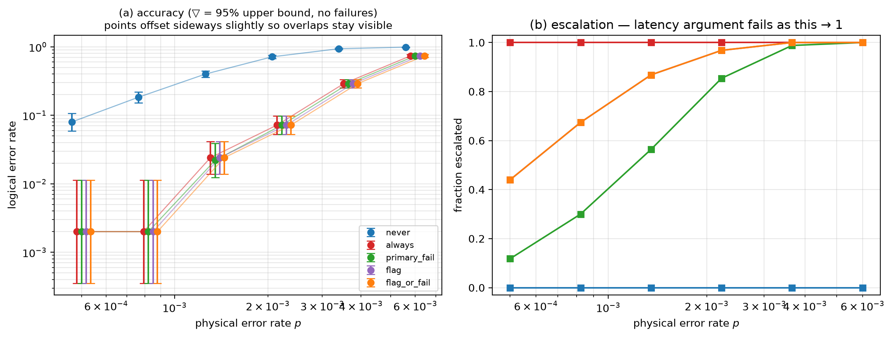

# E2 — [[72, 12, 6]], T=6, 500 shots/point

Data file: `E2_72-12-6_T6_p0.001_500shots_seed20260921_flags_osd0.json`  
Exported: 2026-09-23T01:33:40

## Table: sweep_metrics

[sweep_metrics.csv](sweep_metrics.csv) — 30 rows

| p | policy | shots | failures | ler | ci_low | ci_high | escalation_rate | silent_failures | unconverged_failures | escalated_failures | work_mean | work_p99 | time_p50_us | time_p99_us |
|---|---|---|---|---|---|---|---|---|---|---|---|---|---|---|
| 0.0005 | never | 500 | 40 | 0.08 | 0.0593 | 0.1071 | 0 | 0 | 40 | 0 | 8.654 | 32.01 | 4122 | 2.271e+04 |
| 0.0005 | always | 500 | 1 | 0.002 | 0.0003531 | 0.01124 | 1 | 0 | 0 | 1 | 11.41 | 20 | 8341 | 5.141e+04 |
| 0.0005 | primary_fail | 500 | 1 | 0.002 | 0.0003531 | 0.01124 | 0.118 | 0 | 0 | 1 | 10.71 | 52.01 | 4276 | 6.063e+04 |
| 0.0005 | flag | 500 | 1 | 0.002 | 0.0003531 | 0.01124 | 0.44 | 0 | 0 | 1 | 9.884 | 38.02 | 5058 | 5.538e+04 |
| 0.0005 | flag_or_fail | 500 | 1 | 0.002 | 0.0003531 | 0.01124 | 0.44 | 0 | 0 | 1 | 9.884 | 38.02 | 5058 | 5.538e+04 |
| 0.0008219 | never | 500 | 92 | 0.184 | 0.1525 | 0.2203 | 0 | 0 | 92 | 0 | 14.28 | 41.02 | 6465 | 2.923e+04 |
| 0.0008219 | always | 500 | 1 | 0.002 | 0.0003531 | 0.01124 | 1 | 0 | 0 | 1 | 13.74 | 20 | 2.197e+04 | 5.838e+04 |
| 0.0008219 | primary_fail | 500 | 1 | 0.002 | 0.0003531 | 0.01124 | 0.3 | 0 | 0 | 1 | 19.6 | 61.02 | 7257 | 7.895e+04 |
| 0.0008219 | flag | 500 | 1 | 0.002 | 0.0003531 | 0.01124 | 0.674 | 0 | 0 | 1 | 14.97 | 51 | 1.612e+04 | 6.486e+04 |
| 0.0008219 | flag_or_fail | 500 | 1 | 0.002 | 0.0003531 | 0.01124 | 0.674 | 0 | 0 | 1 | 14.97 | 51 | 1.612e+04 | 6.486e+04 |
| 0.001351 | never | 500 | 200 | 0.4 | 0.358 | 0.4435 | 0 | 0 | 200 | 0 | 24.57 | 61.02 | 1.235e+04 | 4.995e+04 |
| 0.001351 | always | 500 | 12 | 0.024 | 0.01378 | 0.04148 | 1 | 0 | 0 | 12 | 16.87 | 20 | 3.44e+04 | 1.071e+05 |
| 0.001351 | primary_fail | 500 | 11 | 0.022 | 0.01233 | 0.03896 | 0.564 | 0 | 0 | 11 | 35.27 | 81.02 | 3.875e+04 | 1.364e+05 |
| 0.001351 | flag | 500 | 12 | 0.024 | 0.01378 | 0.04148 | 0.868 | 0 | 0 | 12 | 19.61 | 59.01 | 3.436e+04 | 1.076e+05 |
| 0.001351 | flag_or_fail | 500 | 12 | 0.024 | 0.01378 | 0.04148 | 0.868 | 0 | 0 | 12 | 19.61 | 59.01 | 3.436e+04 | 1.076e+05 |
| 0.002221 | never | 500 | 357 | 0.714 | 0.6729 | 0.7519 | 0 | 0 | 357 | 0 | 41.86 | 92.02 | 1.906e+04 | 5.535e+04 |
| 0.002221 | always | 500 | 36 | 0.072 | 0.05246 | 0.09807 | 1 | 0 | 0 | 36 | 18.95 | 20 | 3.006e+04 | 1.57e+05 |
| 0.002221 | primary_fail | 500 | 36 | 0.072 | 0.05246 | 0.09807 | 0.854 | 0 | 0 | 36 | 58.68 | 112 | 5.208e+04 | 1.914e+05 |
| 0.002221 | flag | 500 | 36 | 0.072 | 0.05246 | 0.09807 | 0.968 | 0 | 0 | 36 | 20.64 | 59 | 3.079e+04 | 1.57e+05 |
| 0.002221 | flag_or_fail | 500 | 36 | 0.072 | 0.05246 | 0.09807 | 0.968 | 0 | 0 | 36 | 20.64 | 59 | 3.079e+04 | 1.57e+05 |
| 0.00365 | never | 500 | 469 | 0.938 | 0.9133 | 0.956 | 0 | 0 | 469 | 0 | 68.93 | 130 | 2.834e+04 | 6.139e+04 |
| 0.00365 | always | 500 | 145 | 0.29 | 0.2519 | 0.3313 | 1 | 0 | 0 | 145 | 19.82 | 20 | 5.262e+04 | 2.851e+05 |
| 0.00365 | primary_fail | 500 | 145 | 0.29 | 0.2519 | 0.3313 | 0.988 | 0 | 0 | 145 | 88.57 | 150 | 8.313e+04 | 3.265e+05 |
| 0.00365 | flag | 500 | 145 | 0.29 | 0.2519 | 0.3313 | 1 | 0 | 0 | 145 | 20.66 | 61.01 | 5.328e+04 | 2.851e+05 |
| 0.00365 | flag_or_fail | 500 | 145 | 0.29 | 0.2519 | 0.3313 | 1 | 0 | 0 | 145 | 20.66 | 61.01 | 5.328e+04 | 2.851e+05 |
| 0.006 | never | 500 | 494 | 0.988 | 0.9741 | 0.9945 | 0 | 0 | 494 | 0 | 107.6 | 164 | 3.731e+04 | 6.489e+04 |
| 0.006 | always | 500 | 369 | 0.738 | 0.6977 | 0.7746 | 1 | 0 | 0 | 369 | 20 | 20 | 1.615e+05 | 4.419e+05 |
| 0.006 | primary_fail | 500 | 369 | 0.738 | 0.6977 | 0.7746 | 1 | 0 | 0 | 369 | 127.6 | 184 | 1.99e+05 | 4.848e+05 |
| 0.006 | flag | 500 | 369 | 0.738 | 0.6977 | 0.7746 | 1 | 0 | 0 | 369 | 20.4 | 20 | 1.615e+05 | 4.419e+05 |
| 0.006 | flag_or_fail | 500 | 369 | 0.738 | 0.6977 | 0.7746 | 1 | 0 | 0 | 369 | 20.4 | 20 | 1.615e+05 | 4.419e+05 |

## Figure: sweep

  
Vector version: [sweep.pdf](sweep.pdf)
