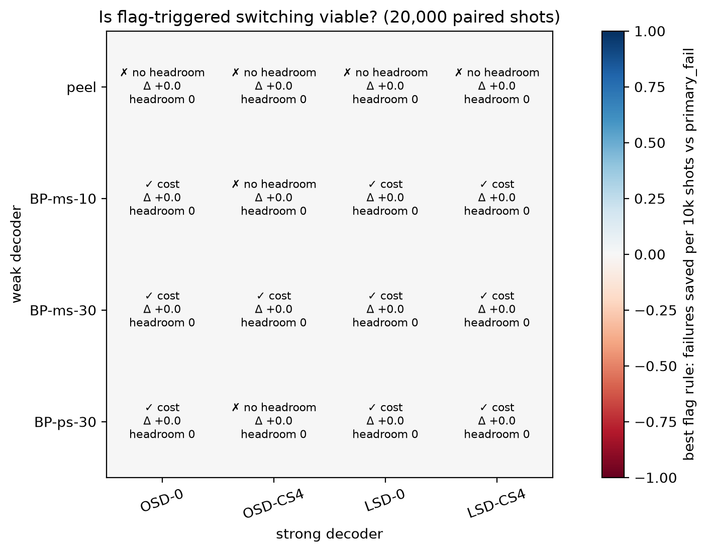
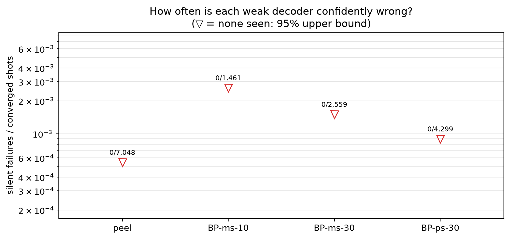
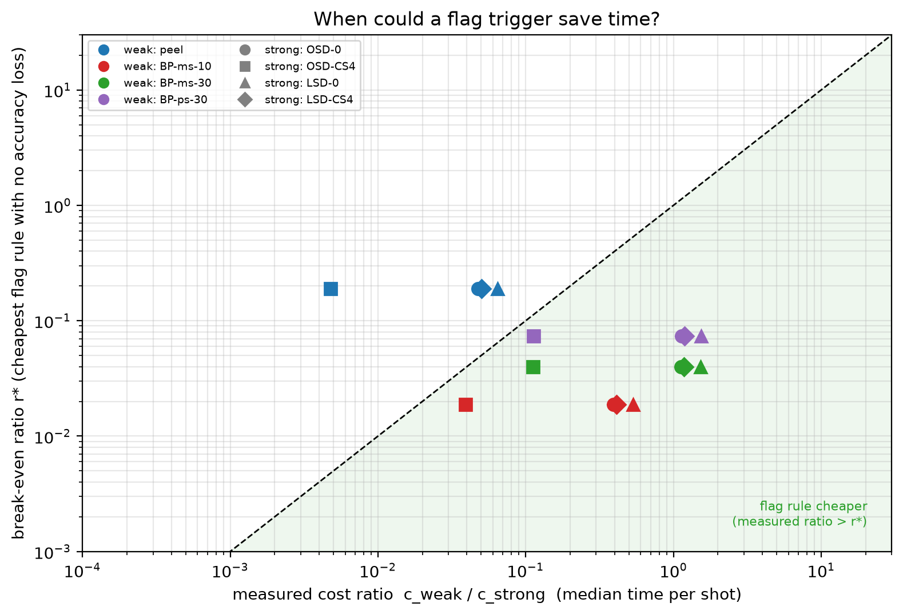
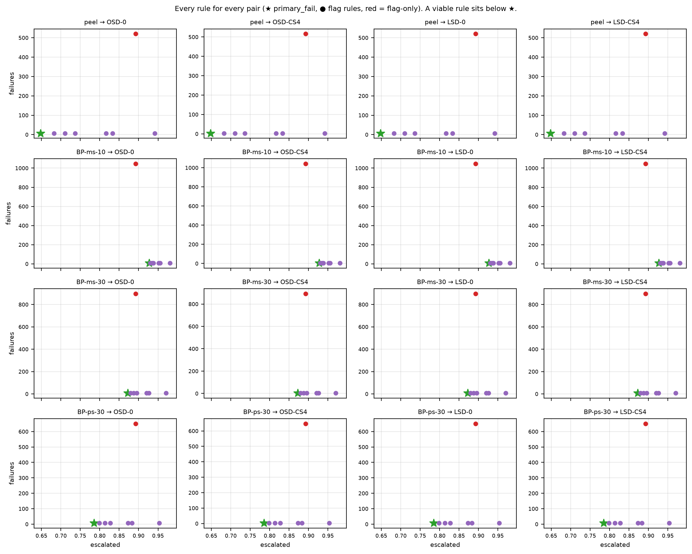

# E3 decoder zoo — 20,000 shots

Data file: `E3_144-12-12_T6_p0.001_20000shots_seed20260922.npz`  
Exported: 2026-09-24T20:22:13

Verdict counts: not viable: 6, viable: cost: 10

## Table: verdicts

[verdicts.csv](verdicts.csv) — 16 rows

| weak | strong | verdict | verdict_accuracy | verdict_cost | headroom | min_detectable_discordant | pf_failures | pf_escalation | pf_cost_us | always_failures | best_accuracy_rule | best_cost_rule | best_saving | cost_ratio |
|---|---|---|---|---|---|---|---|---|---|---|---|---|---|---|
| peel | OSD-0 | not viable | impossible: no headroom | not viable | 0 | 6 | 7 | 0.6476 | 4.656e+05 | 7 | None | None | -0.02718 | 0.04778 |
| peel | OSD-CS4 | not viable | impossible: no headroom | not viable | 0 | 6 | 3 | 0.6476 | 4.435e+06 | 3 | None | None | -0.04752 | 0.004753 |
| peel | LSD-0 | not viable | impossible: no headroom | not viable | 0 | 6 | 7 | 0.6476 | 3.864e+05 | 7 | None | None | -0.02154 | 0.06472 |
| peel | LSD-CS4 | not viable | impossible: no headroom | not viable | 0 | 6 | 7 | 0.6476 | 4.181e+05 | 7 | None | None | -0.02322 | 0.05001 |
| BP-ms-10 | OSD-0 | viable: cost | impossible: no headroom | viable: cost | 0 | 6 | 7 | 0.927 | 8.574e+05 | 7 | None | flag>=1 | 0.2491 | 0.393 |
| BP-ms-10 | OSD-CS4 | not viable | impossible: no headroom | not viable | 0 | 6 | 3 | 0.927 | 6.54e+06 | 3 | None | None | 0.03328 | 0.03909 |
| BP-ms-10 | LSD-0 | viable: cost | impossible: no headroom | viable: cost | 0 | 6 | 7 | 0.927 | 7.368e+05 | 7 | None | flag>=1 | 0.2914 | 0.5322 |
| BP-ms-10 | LSD-CS4 | viable: cost | impossible: no headroom | viable: cost | 0 | 6 | 7 | 0.927 | 7.825e+05 | 7 | None | flag>=1 | 0.2738 | 0.4113 |
| BP-ms-30 | OSD-0 | viable: cost | impossible: no headroom | viable: cost | 0 | 6 | 7 | 0.872 | 1.268e+06 | 7 | None | flag>=1 | 0.464 | 1.123 |
| BP-ms-30 | OSD-CS4 | viable: cost | impossible: no headroom | viable: cost | 0 | 6 | 3 | 0.872 | 6.964e+06 | 3 | None | flag>=1 | 0.08665 | 0.1117 |
| BP-ms-30 | LSD-0 | viable: cost | impossible: no headroom | viable: cost | 0 | 6 | 7 | 0.872 | 1.151e+06 | 7 | None | flag>=1 | 0.5148 | 1.52 |
| BP-ms-30 | LSD-CS4 | viable: cost | impossible: no headroom | viable: cost | 0 | 6 | 7 | 0.872 | 1.195e+06 | 7 | None | flag>=1 | 0.4943 | 1.175 |
| BP-ps-30 | OSD-0 | viable: cost | impossible: no headroom | viable: cost | 0 | 6 | 7 | 0.7851 | 1.21e+06 | 7 | None | flag>=1 | 0.4515 | 1.139 |
| BP-ps-30 | OSD-CS4 | not viable | impossible: no headroom | not viable | 0 | 6 | 3 | 0.7851 | 6.094e+06 | 3 | None | None | 0.01174 | 0.1133 |
| BP-ps-30 | LSD-0 | viable: cost | impossible: no headroom | viable: cost | 0 | 6 | 7 | 0.7851 | 1.108e+06 | 7 | None | flag>=1 | 0.5079 | 1.542 |
| BP-ps-30 | LSD-CS4 | viable: cost | impossible: no headroom | viable: cost | 0 | 6 | 7 | 0.7851 | 1.148e+06 | 7 | None | flag>=1 | 0.4856 | 1.192 |

## Table: weak_decoders

[weak_decoders.csv](weak_decoders.csv) — 4 rows

| weak | converged | silent | silent_rate | silent_rate_upper | silent_on_flagged | median_time_us |
|---|---|---|---|---|---|---|
| peel | 7048 | 0 | 0 | 0.0005448 | 0 | 3.334e+04 |
| BP-ms-10 | 1461 | 0 | 0 | 0.002623 | 0 | 2.742e+05 |
| BP-ms-30 | 2559 | 0 | 0 | 0.001499 | 0 | 7.831e+05 |
| BP-ps-30 | 4299 | 0 | 0 | 0.0008928 | 0 | 7.945e+05 |

## Table: all_rules

[all_rules.csv](all_rules.csv) — 128 rows

## Table: flag_diagnostics

[flag_diagnostics.csv](flag_diagnostics.csv) — 8 rows

| decoder | flagged_fraction | error_rate_flagged | error_rate_unflagged | risk_ratio | mutual_information_bits | share_of_failures_on_flagged |
|---|---|---|---|---|---|---|
| peel | 0.8925 | 0.4503 | 0.2387 | 1.887 | 0.01344 | 0.94 |
| BP-ms-10 | 0.8925 | 0.6762 | 0.483 | 1.4 | 0.0109 | 0.9208 |
| BP-ms-30 | 0.8925 | 0.6107 | 0.4137 | 1.476 | 0.01089 | 0.9246 |
| BP-ps-30 | 0.8925 | 0.5245 | 0.2997 | 1.75 | 0.01434 | 0.9356 |
| OSD-0 | 0.8925 | 0.0003921 | 0 | inf | 5.741e-05 | 1 |
| OSD-CS4 | 0.8925 | 0.0001681 | 0 | inf | 2.46e-05 | 1 |
| LSD-0 | 0.8925 | 0.0003921 | 0 | inf | 5.741e-05 | 1 |
| LSD-CS4 | 0.8925 | 0.0003921 | 0 | inf | 5.741e-05 | 1 |

## Table: strong_ceiling

[strong_ceiling.csv](strong_ceiling.csv) — 12 rows

| decoder | compared_with | failures | fixed_by_other | broken_by_other |
|---|---|---|---|---|
| OSD-0 | OSD-CS4 | 7 | 4 | 0 |
| OSD-0 | LSD-0 | 7 | 0 | 0 |
| OSD-0 | LSD-CS4 | 7 | 0 | 0 |
| OSD-CS4 | OSD-0 | 3 | 0 | 4 |
| OSD-CS4 | LSD-0 | 3 | 0 | 4 |
| OSD-CS4 | LSD-CS4 | 3 | 0 | 4 |
| LSD-0 | OSD-0 | 7 | 0 | 0 |
| LSD-0 | OSD-CS4 | 7 | 4 | 0 |
| LSD-0 | LSD-CS4 | 7 | 0 | 0 |
| LSD-CS4 | OSD-0 | 7 | 0 | 0 |
| LSD-CS4 | OSD-CS4 | 7 | 4 | 0 |
| LSD-CS4 | LSD-0 | 7 | 0 | 0 |

## Figure: verdicts

  
Vector version: [verdicts.pdf](verdicts.pdf)

## Figure: silent_failures

  
Vector version: [silent_failures.pdf](silent_failures.pdf)

## Figure: breakeven

  
Vector version: [breakeven.pdf](breakeven.pdf)

## Figure: tradeoffs

  
Vector version: [tradeoffs.pdf](tradeoffs.pdf)
