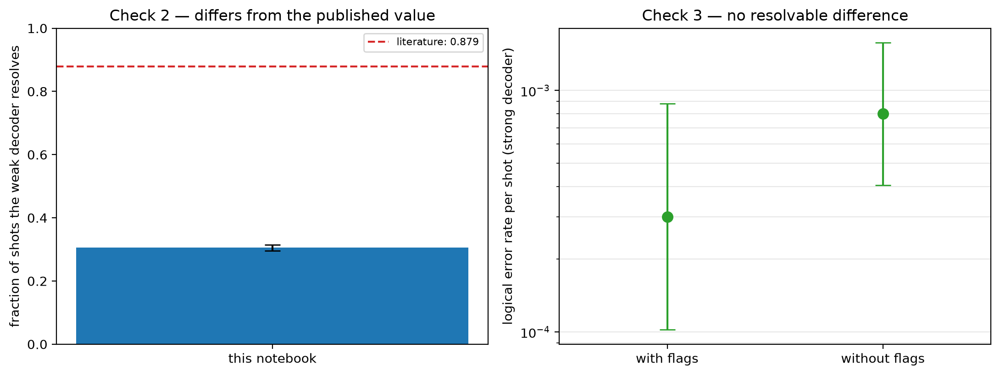

# Experiment 1 validation — [[144, 12, 12]], T=12, p=0.001

Data file: `EXP1_144-12-12_T12_p0.001_10000shots.json`  
Exported: 2026-09-29T20:12:09

Literature source: Pakhunov (2026), Table II, [[144,12,12]], p=1e-3, T=12

## Table: checks

[checks.csv](checks.csv) — 4 rows

| check | value | detail |
|---|---|---|
| Check 1: fault-model density | 1.4× | 8,784 faults vs 6,192 from n(wT + T/2 + 1) |
| Check 2: reproduces literature | no | ours 0.305 [0.296, 0.314] vs 0.879 (Pakhunov (2026), Table II, [[144,12,12]], p=1e-3, T=12) |
| Check 3: accuracy cost of flags | no resolvable difference | LER 3.00e-04 with flags vs 8.00e-04 without; +2,592 faults, +864 detectors; flags fire on 99.1% of shots |
| silent failures (weak decoder) | 0 flagged / 0 unflagged | the only failures a flag trigger could ever catch |

## Figure: validation

  
Vector version: [validation.pdf](validation.pdf)
