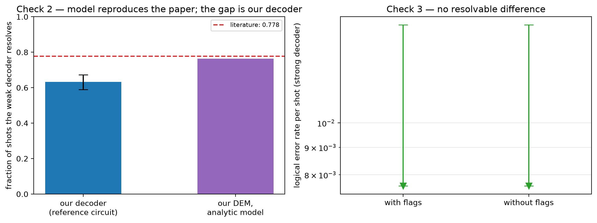

# Experiment 1 validation — [[288, 12, 18]], T=12, p=0.001

Data file: `EXP1_288-12-18_T12_p0.001_500shots.json`  
Exported: 2026-09-30T03:08:15

Literature source: Pakhunov (2026), Table II, [288,12,18]], p=1e-3, T=12

## Table: checks

[checks.csv](checks.csv) — 5 rows

| check | value | detail |
|---|---|---|
| Check 1: fault-model density | 1.4× | 17,568 faults vs 12,384 from n(wT + T/2 + 1) |
| Check 2a: model reproduces literature | yes | analytic prediction on our own DEM 0.764 vs 0.778 (Pakhunov (2026), Table II, [288,12,18]], p=1e-3, T=12); lambda 12.31, mean degree 50.6 |
| Check 2b: our decoder against that model | +0.132 | measured 0.632 [0.589, 0.673] on the REFERENCE circuit; on the experiment circuit it reads 0.074, which extracts both check families and so is not comparable to the paper |
| Check 3: accuracy cost of flags | no resolvable difference | LER 0.00e+00 with flags vs 0.00e+00 without; +5,184 faults, +1728 detectors; flags fire on 100.0% of shots |
| silent failures (weak decoder) | 0 flagged / 0 unflagged | the only failures a flag trigger could ever catch |

## Figure: validation

  
Vector version: [validation.pdf](validation.pdf)
