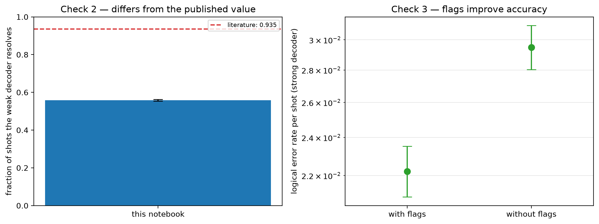

# Experiment 1 validation — [[46, 2, 9]], T=6, p=0.001

Data file: `EXP1_46-2-9_T6_p0.001_50000shots.json`  
Exported: 2026-09-28T11:08:40

Literature source: Pakhunov (2026), Table II, [[72,12,6]], p=1e-3, T=12

## Table: checks

[checks.csv](checks.csv) — 4 rows

| check | value | detail |
|---|---|---|
| Check 1: fault-model density | 1.4× | 2,530 faults vs 1,840 from n(wT + T/2 + 1) |
| Check 2: reproduces literature | no | ours 0.559 [0.555, 0.563] vs 0.935 (Pakhunov (2026), Table II, [[72,12,6]], p=1e-3, T=12) |
| Check 3: accuracy cost of flags | flags improve accuracy | LER 2.22e-02 with flags vs 2.95e-02 without; +414 faults, +138 detectors; flags fire on 63.5% of shots |
| silent failures (weak decoder) | 0 flagged / 0 unflagged | the only failures a flag trigger could ever catch |

## Figure: validation

  
Vector version: [validation.pdf](validation.pdf)
