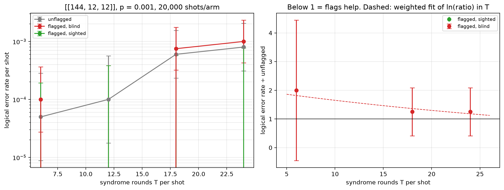

# Flag trade-off study — [[144, 12, 12]], p = 0.001

Data file: `EXP2_144-12-12_p0.001_20000shots_seed20260923_osd4_scaled.json`  
Exported: 2026-09-28T08:45:01

**No crossover within the fitted range**: on this fit the flagged-and-sighted arm does not reach parity with the unflagged circuit over the T values measured.

## Table: points

[points.csv](points.csv) — 4 rows

| rounds | shots | unflagged failures | flagged, blind failures | flagged, sighted failures | unflagged LER | flagged, blind LER | flagged, sighted LER | ratio_sighted | ratio_blind | flagged_fraction | mean_flags | blind_only_fail | sighted_only_fail |
|---|---|---|---|---|---|---|---|---|---|---|---|---|---|
| 6 | 20000 | 1 | 2 | 0 | 5e-05 | 0.0001 | 0 | nan | 2 | 0.8934 | 2.232 | 2 | 0 |
| 12 | 10000 | 1 | 0 | 0 | 0.0001 | 0 | 0 | nan | nan | 0.9878 | 4.479 | 0 | 0 |
| 18 | 6667 | 4 | 5 | 0 | 0.0006 | 0.00075 | 0 | nan | 1.25 | 0.9994 | 6.742 | 5 | 0 |
| 24 | 5000 | 4 | 5 | 0 | 0.0008 | 0.001 | 0 | nan | 1.25 | 0.9996 | 9.005 | 5 | 0 |

## Table: overhead

[overhead.csv](overhead.csv) — 4 rows

| rounds | qubits_unflagged | qubits_flagged | qubit_overhead | gate_overhead | fault_overhead | lambda_unflagged | lambda_flagged |
|---|---|---|---|---|---|---|---|
| 6 | 288 | 360 | 0.25 | 0.1667 | 0.2903 | 5.062 | 6.615 |
| 12 | 288 | 360 | 0.25 | 0.1667 | 0.2951 | 9.836 | 12.94 |
| 18 | 288 | 360 | 0.25 | 0.1667 | 0.2967 | 14.61 | 19.27 |
| 24 | 288 | 360 | 0.25 | 0.1667 | 0.2975 | 19.38 | 25.6 |

## Figure: three_arms_vs_rounds

  
Vector version: [three_arms_vs_rounds.pdf](three_arms_vs_rounds.pdf)
