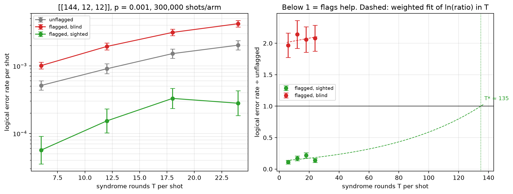

# Flag trade-off study — [[144, 12, 12]], p = 0.001

Data file: `EXP2_144-12-12_p0.001_300000shots_seed20260923_osd0_scaled.json`  
Exported: 2026-09-30T02:09:34

**Flags pay up to T\* ≈ 135** and cost accuracy beyond it (weighted fit, slope +0.015 per round).

## Table: points

[points.csv](points.csv) — 4 rows

| rounds | shots | unflagged failures | flagged, blind failures | flagged, sighted failures | unflagged LER | flagged, blind LER | flagged, sighted LER | ratio_sighted | ratio_blind | flagged_fraction | mean_flags | blind_only_fail | sighted_only_fail |
|---|---|---|---|---|---|---|---|---|---|---|---|---|---|
| 6 | 300000 | 154 | 303 | 17 | 0.0005133 | 0.00101 | 5.667e-05 | 0.1104 | 1.968 | 0.8939 | 2.24 | 298 | 12 |
| 12 | 150000 | 136 | 291 | 23 | 0.0009067 | 0.00194 | 0.0001533 | 0.1691 | 2.14 | 0.9887 | 4.475 | 280 | 12 |
| 18 | 100000 | 152 | 313 | 33 | 0.00152 | 0.00313 | 0.00033 | 0.2171 | 2.059 | 0.9989 | 6.703 | 292 | 12 |
| 24 | 75000 | 152 | 316 | 21 | 0.002027 | 0.004213 | 0.00028 | 0.1382 | 2.079 | 0.9999 | 8.963 | 303 | 8 |

## Table: overhead

[overhead.csv](overhead.csv) — 4 rows

| rounds | qubits_unflagged | qubits_flagged | qubit_overhead | gate_overhead | fault_overhead | lambda_unflagged | lambda_flagged |
|---|---|---|---|---|---|---|---|
| 6 | 288 | 360 | 0.25 | 0.1667 | 0.2903 | 5.062 | 6.615 |
| 12 | 288 | 360 | 0.25 | 0.1667 | 0.2951 | 9.836 | 12.94 |
| 18 | 288 | 360 | 0.25 | 0.1667 | 0.2967 | 14.61 | 19.27 |
| 24 | 288 | 360 | 0.25 | 0.1667 | 0.2975 | 19.38 | 25.6 |

## Figure: three_arms_vs_rounds

  
Vector version: [three_arms_vs_rounds.pdf](three_arms_vs_rounds.pdf)
