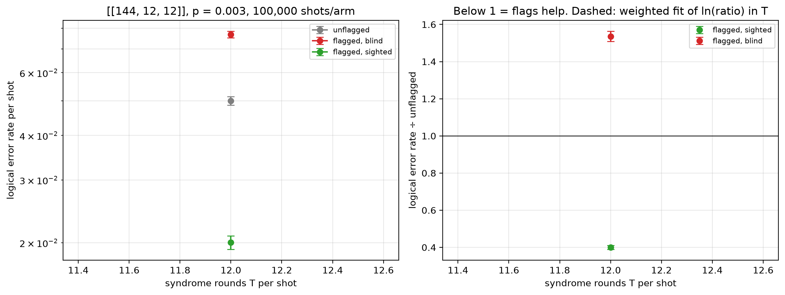

# Flag trade-off study — [[144, 12, 12]], p = 0.003

Data file: `EXP2_144-12-12_p0.003_100000shots_seed20260923_osd0_scaled.json`  
Exported: 2026-09-30T17:23:03

**No crossover within the fitted range**: on this fit the flagged-and-sighted arm does not reach parity with the unflagged circuit over the T values measured.

## Table: points

[points.csv](points.csv) — 1 rows

| rounds | shots | unflagged failures | flagged, blind failures | flagged, sighted failures | unflagged LER | flagged, blind LER | flagged, sighted LER | ratio_sighted | ratio_blind | flagged_fraction | mean_flags | blind_only_fail | sighted_only_fail |
|---|---|---|---|---|---|---|---|---|---|---|---|---|---|
| 12 | 100000 | 5001 | 7682 | 2003 | 0.05001 | 0.07682 | 0.02003 | 0.4005 | 1.536 | 1 | 13.32 | 6369 | 690 |

## Table: overhead

[overhead.csv](overhead.csv) — 1 rows

| rounds | qubits_unflagged | qubits_flagged | qubit_overhead | gate_overhead | fault_overhead | lambda_unflagged | lambda_flagged |
|---|---|---|---|---|---|---|---|
| 12 | 288 | 360 | 0.25 | 0.1667 | 0.2951 | 29.43 | 38.73 |

## Figure: three_arms_vs_rounds

  
Vector version: [three_arms_vs_rounds.pdf](three_arms_vs_rounds.pdf)
