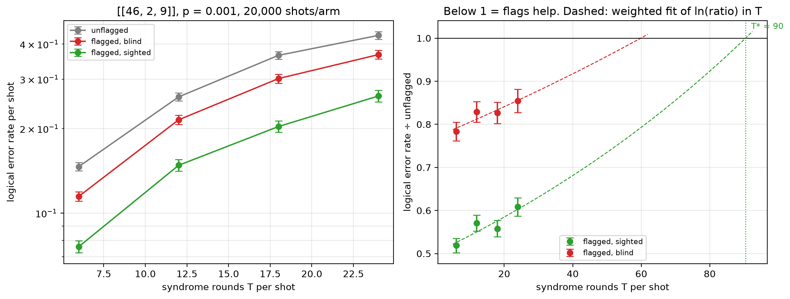

# Flag trade-off study — [[46, 2, 9]], p = 0.001

Data file: `EXP2_46-2-9_p0.001_20000shots_seed20260923_osd0_scaled.json`  
Exported: 2026-09-28T09:41:52

**Flags pay up to T\* ≈ 90** and cost accuracy beyond it (weighted fit, slope +0.008 per round).

## Table: points

[points.csv](points.csv) — 4 rows

| rounds | shots | unflagged failures | flagged, blind failures | flagged, sighted failures | unflagged LER | flagged, blind LER | flagged, sighted LER | ratio_sighted | ratio_blind | flagged_fraction | mean_flags | blind_only_fail | sighted_only_fail |
|---|---|---|---|---|---|---|---|---|---|---|---|---|---|
| 6 | 20000 | 2927 | 2293 | 1518 | 0.1464 | 0.1147 | 0.0759 | 0.5186 | 0.7834 | 0.6408 | 1.017 | 1516 | 741 |
| 12 | 10000 | 2593 | 2149 | 1480 | 0.2593 | 0.2149 | 0.148 | 0.5708 | 0.8288 | 0.8702 | 2.025 | 1338 | 669 |
| 18 | 6667 | 2431 | 2009 | 1356 | 0.3646 | 0.3013 | 0.2034 | 0.5578 | 0.8264 | 0.9507 | 3.017 | 1258 | 605 |
| 24 | 5000 | 2147 | 1834 | 1306 | 0.4294 | 0.3668 | 0.2612 | 0.6083 | 0.8542 | 0.9818 | 4.05 | 1106 | 578 |

## Table: overhead

[overhead.csv](overhead.csv) — 4 rows

| rounds | qubits_unflagged | qubits_flagged | qubit_overhead | gate_overhead | fault_overhead | lambda_unflagged | lambda_flagged |
|---|---|---|---|---|---|---|---|
| 6 | 92 | 115 | 0.25 | 0.1 | 0.1636 | 2.498 | 2.995 |
| 12 | 92 | 115 | 0.25 | 0.1 | 0.1651 | 4.905 | 5.898 |
| 18 | 92 | 115 | 0.25 | 0.1 | 0.1656 | 7.312 | 8.8 |
| 24 | 92 | 115 | 0.25 | 0.1 | 0.1659 | 9.718 | 11.7 |

## Figure: three_arms_vs_rounds

  
Vector version: [three_arms_vs_rounds.pdf](three_arms_vs_rounds.pdf)
