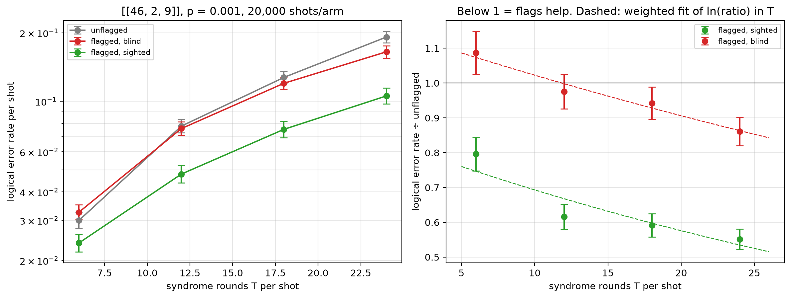

# Flag trade-off study — [[46, 2, 9]], p = 0.001

Data file: `EXP2_46-2-9_p0.001_20000shots_seed20260923_osd4_scaled.json`  
Exported: 2026-09-28T09:35:36

**No crossover within the fitted range**: on this fit the flagged-and-sighted arm does not reach parity with the unflagged circuit over the T values measured.

## Table: points

[points.csv](points.csv) — 4 rows

| rounds | shots | unflagged failures | flagged, blind failures | flagged, sighted failures | unflagged LER | flagged, blind LER | flagged, sighted LER | ratio_sighted | ratio_blind | flagged_fraction | mean_flags | blind_only_fail | sighted_only_fail |
|---|---|---|---|---|---|---|---|---|---|---|---|---|---|
| 6 | 20000 | 599 | 651 | 477 | 0.02995 | 0.03255 | 0.02385 | 0.7963 | 1.087 | 0.6408 | 1.017 | 503 | 329 |
| 12 | 10000 | 778 | 759 | 479 | 0.0778 | 0.0759 | 0.0479 | 0.6157 | 0.9756 | 0.8702 | 2.025 | 586 | 306 |
| 18 | 6667 | 849 | 800 | 502 | 0.1273 | 0.12 | 0.0753 | 0.5913 | 0.9423 | 0.9507 | 3.017 | 588 | 290 |
| 24 | 5000 | 958 | 825 | 528 | 0.1916 | 0.165 | 0.1056 | 0.5511 | 0.8612 | 0.9818 | 4.05 | 605 | 308 |

## Table: overhead

[overhead.csv](overhead.csv) — 4 rows

| rounds | qubits_unflagged | qubits_flagged | qubit_overhead | gate_overhead | fault_overhead | lambda_unflagged | lambda_flagged |
|---|---|---|---|---|---|---|---|
| 6 | 92 | 115 | 0.25 | 0.1 | 0.1636 | 2.498 | 2.995 |
| 12 | 92 | 115 | 0.25 | 0.1 | 0.1651 | 4.905 | 5.898 |
| 18 | 92 | 115 | 0.25 | 0.1 | 0.1656 | 7.312 | 8.8 |
| 24 | 92 | 115 | 0.25 | 0.1 | 0.1659 | 9.718 | 11.7 |

## Figure: three_arms_vs_rounds

  
Vector version: [three_arms_vs_rounds.pdf](three_arms_vs_rounds.pdf)
