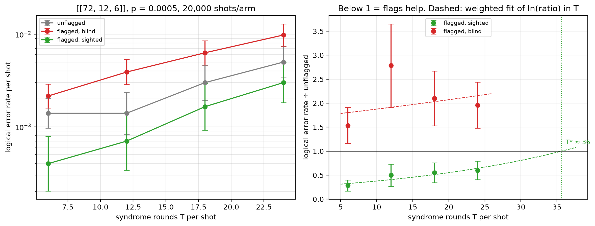

# Flag trade-off study — [[72, 12, 6]], p = 0.0005

Data file: `EXP2_72-12-6_p0.0005_20000shots_seed20260923_osd0_scaled.json`  
Exported: 2026-09-28T09:59:30

**Flags pay up to T\* ≈ 36** and cost accuracy beyond it (weighted fit, slope +0.038 per round).

## Table: points

[points.csv](points.csv) — 4 rows

| rounds | shots | unflagged failures | flagged, blind failures | flagged, sighted failures | unflagged LER | flagged, blind LER | flagged, sighted LER | ratio_sighted | ratio_blind | flagged_fraction | mean_flags | blind_only_fail | sighted_only_fail |
|---|---|---|---|---|---|---|---|---|---|---|---|---|---|
| 6 | 20000 | 28 | 43 | 8 | 0.0014 | 0.00215 | 0.0004 | 0.2857 | 1.536 | 0.4338 | 0.5668 | 39 | 4 |
| 12 | 10000 | 14 | 39 | 7 | 0.0014 | 0.0039 | 0.0007 | 0.5 | 2.786 | 0.6858 | 1.138 | 35 | 3 |
| 18 | 6667 | 20 | 42 | 11 | 0.003 | 0.0063 | 0.00165 | 0.55 | 2.1 | 0.811 | 1.676 | 34 | 3 |
| 24 | 5000 | 25 | 49 | 15 | 0.005 | 0.0098 | 0.003 | 0.6 | 1.96 | 0.895 | 2.269 | 37 | 3 |

## Table: overhead

[overhead.csv](overhead.csv) — 4 rows

| rounds | qubits_unflagged | qubits_flagged | qubit_overhead | gate_overhead | fault_overhead | lambda_unflagged | lambda_flagged |
|---|---|---|---|---|---|---|---|
| 6 | 144 | 180 | 0.25 | 0.1667 | 0.2903 | 1.266 | 1.655 |
| 12 | 144 | 180 | 0.25 | 0.1667 | 0.2951 | 2.461 | 3.238 |
| 18 | 144 | 180 | 0.25 | 0.1667 | 0.2967 | 3.655 | 4.821 |
| 24 | 144 | 180 | 0.25 | 0.1667 | 0.2975 | 4.849 | 6.404 |

## Figure: three_arms_vs_rounds

  
Vector version: [three_arms_vs_rounds.pdf](three_arms_vs_rounds.pdf)
