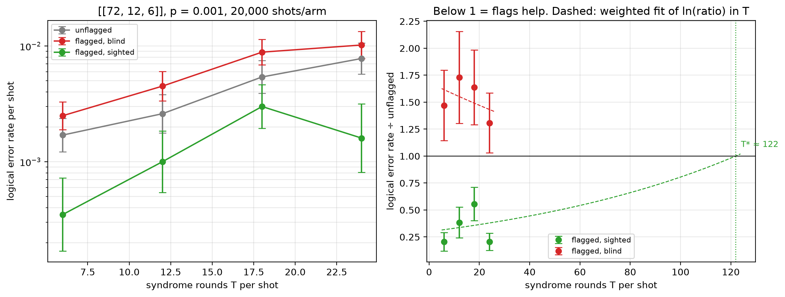

# Flag trade-off study — [[72, 12, 6]], p = 0.001

Data file: `EXP2_72-12-6_p0.001_20000shots_seed20260923_osd4_scaled.json`  
Exported: 2026-09-28T06:02:42

**Flags pay up to T\* ≈ 122** and cost accuracy beyond it (weighted fit, slope +0.010 per round).

## Table: points

[points.csv](points.csv) — 4 rows

| rounds | shots | unflagged failures | flagged, blind failures | flagged, sighted failures | unflagged LER | flagged, blind LER | flagged, sighted LER | ratio_sighted | ratio_blind | flagged_fraction | mean_flags | blind_only_fail | sighted_only_fail |
|---|---|---|---|---|---|---|---|---|---|---|---|---|---|
| 6 | 20000 | 34 | 50 | 7 | 0.0017 | 0.0025 | 0.00035 | 0.2059 | 1.471 | 0.6751 | 1.117 | 46 | 3 |
| 12 | 10000 | 26 | 45 | 10 | 0.0026 | 0.0045 | 0.001 | 0.3846 | 1.731 | 0.8969 | 2.243 | 41 | 6 |
| 18 | 6667 | 36 | 59 | 20 | 0.0054 | 0.00885 | 0.003 | 0.5556 | 1.639 | 0.964 | 3.349 | 52 | 13 |
| 24 | 5000 | 39 | 51 | 8 | 0.0078 | 0.0102 | 0.0016 | 0.2051 | 1.308 | 0.9874 | 4.45 | 49 | 6 |

## Table: overhead

[overhead.csv](overhead.csv) — 4 rows

| rounds | qubits_unflagged | qubits_flagged | qubit_overhead | gate_overhead | fault_overhead | lambda_unflagged | lambda_flagged |
|---|---|---|---|---|---|---|---|
| 6 | 144 | 180 | 0.25 | 0.1667 | 0.2903 | 2.531 | 3.308 |
| 12 | 144 | 180 | 0.25 | 0.1667 | 0.2951 | 4.918 | 6.471 |
| 18 | 144 | 180 | 0.25 | 0.1667 | 0.2967 | 7.305 | 9.635 |
| 24 | 144 | 180 | 0.25 | 0.1667 | 0.2975 | 9.692 | 12.8 |

## Figure: three_arms_vs_rounds

  
Vector version: [three_arms_vs_rounds.pdf](three_arms_vs_rounds.pdf)
