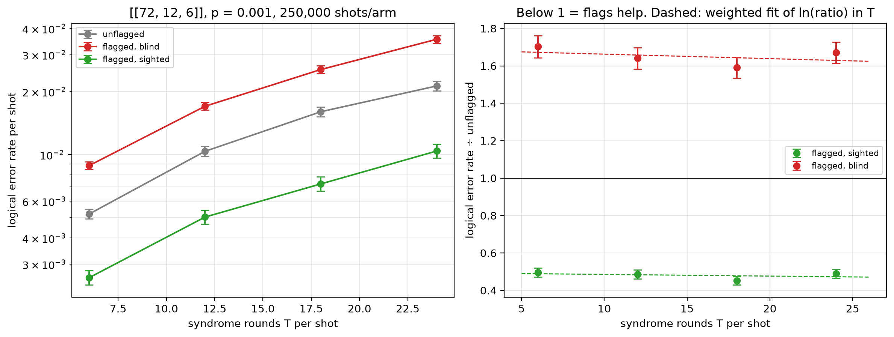

# Flag trade-off study — [[72, 12, 6]], p = 0.001

Data file: `EXP2_72-12-6_p0.001_250000shots_seed20260923_osd0_scaled.json`  
Exported: 2026-09-28T03:30:39

**No crossover within the fitted range**: on this fit the flagged-and-sighted arm does not reach parity with the unflagged circuit over the T values measured.

## Table: points

[points.csv](points.csv) — 4 rows

| rounds | shots | unflagged failures | flagged, blind failures | flagged, sighted failures | unflagged LER | flagged, blind LER | flagged, sighted LER | ratio_sighted | ratio_blind | flagged_fraction | mean_flags | blind_only_fail | sighted_only_fail |
|---|---|---|---|---|---|---|---|---|---|---|---|---|---|
| 6 | 250000 | 1301 | 2215 | 646 | 0.005204 | 0.00886 | 0.002584 | 0.4965 | 1.703 | 0.672 | 1.116 | 1837 | 268 |
| 12 | 125000 | 1296 | 2126 | 629 | 0.01037 | 0.01701 | 0.005032 | 0.4853 | 1.64 | 0.894 | 2.233 | 1737 | 240 |
| 18 | 83333 | 1335 | 2123 | 604 | 0.01602 | 0.02548 | 0.007248 | 0.4524 | 1.59 | 0.9656 | 3.348 | 1765 | 246 |
| 24 | 62500 | 1329 | 2220 | 650 | 0.02126 | 0.03552 | 0.0104 | 0.4891 | 1.67 | 0.9886 | 4.476 | 1811 | 241 |

## Table: overhead

[overhead.csv](overhead.csv) — 4 rows

| rounds | qubits_unflagged | qubits_flagged | qubit_overhead | gate_overhead | fault_overhead | lambda_unflagged | lambda_flagged |
|---|---|---|---|---|---|---|---|
| 6 | 144 | 180 | 0.25 | 0.1667 | 0.2903 | 2.531 | 3.308 |
| 12 | 144 | 180 | 0.25 | 0.1667 | 0.2951 | 4.918 | 6.471 |
| 18 | 144 | 180 | 0.25 | 0.1667 | 0.2967 | 7.305 | 9.635 |
| 24 | 144 | 180 | 0.25 | 0.1667 | 0.2975 | 9.692 | 12.8 |

## Figure: three_arms_vs_rounds

  
Vector version: [three_arms_vs_rounds.pdf](three_arms_vs_rounds.pdf)
