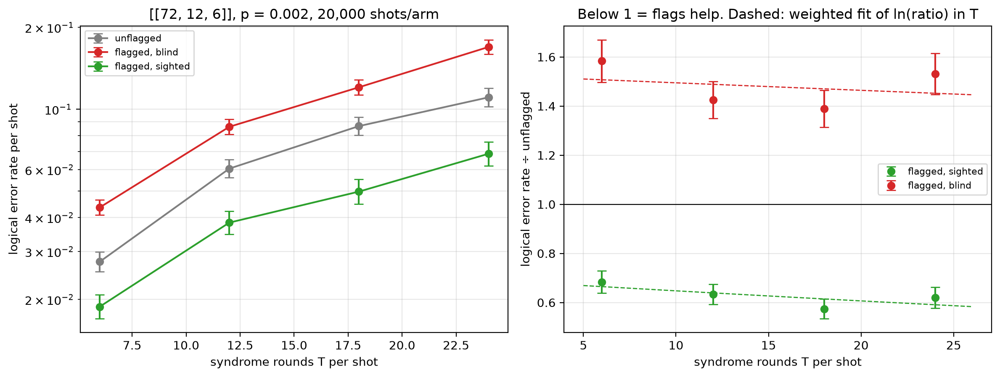

# Flag trade-off study — [[72, 12, 6]], p = 0.002

Data file: `EXP2_72-12-6_p0.002_20000shots_seed20260923_osd0_scaled.json`  
Exported: 2026-09-28T09:51:45

**No crossover within the fitted range**: on this fit the flagged-and-sighted arm does not reach parity with the unflagged circuit over the T values measured.

## Table: points

[points.csv](points.csv) — 4 rows

| rounds | shots | unflagged failures | flagged, blind failures | flagged, sighted failures | unflagged LER | flagged, blind LER | flagged, sighted LER | ratio_sighted | ratio_blind | flagged_fraction | mean_flags | blind_only_fail | sighted_only_fail |
|---|---|---|---|---|---|---|---|---|---|---|---|---|---|
| 6 | 20000 | 550 | 871 | 376 | 0.0275 | 0.04355 | 0.0188 | 0.6836 | 1.584 | 0.8933 | 2.232 | 620 | 125 |
| 12 | 10000 | 605 | 862 | 383 | 0.0605 | 0.0862 | 0.0383 | 0.6331 | 1.425 | 0.9888 | 4.456 | 618 | 139 |
| 18 | 6667 | 578 | 803 | 332 | 0.0867 | 0.1204 | 0.0498 | 0.5744 | 1.389 | 0.9987 | 6.661 | 575 | 104 |
| 24 | 5000 | 553 | 847 | 343 | 0.1106 | 0.1694 | 0.0686 | 0.6203 | 1.532 | 0.9998 | 8.931 | 615 | 111 |

## Table: overhead

[overhead.csv](overhead.csv) — 4 rows

| rounds | qubits_unflagged | qubits_flagged | qubit_overhead | gate_overhead | fault_overhead | lambda_unflagged | lambda_flagged |
|---|---|---|---|---|---|---|---|
| 6 | 144 | 180 | 0.25 | 0.1667 | 0.2903 | 5.055 | 6.607 |
| 12 | 144 | 180 | 0.25 | 0.1667 | 0.2951 | 9.823 | 12.93 |
| 18 | 144 | 180 | 0.25 | 0.1667 | 0.2967 | 14.59 | 19.25 |
| 24 | 144 | 180 | 0.25 | 0.1667 | 0.2975 | 19.36 | 25.56 |

## Figure: three_arms_vs_rounds

  
Vector version: [three_arms_vs_rounds.pdf](three_arms_vs_rounds.pdf)
