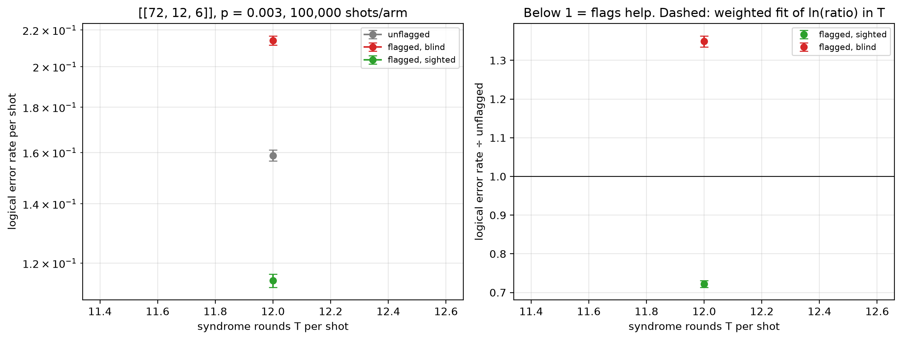

# Flag trade-off study — [[72, 12, 6]], p = 0.003

Data file: `EXP2_72-12-6_p0.003_100000shots_seed20260923_osd0_scaled.json`  
Exported: 2026-09-30T17:11:24

**No crossover within the fitted range**: on this fit the flagged-and-sighted arm does not reach parity with the unflagged circuit over the T values measured.

## Table: points

[points.csv](points.csv) — 1 rows

| rounds | shots | unflagged failures | flagged, blind failures | flagged, sighted failures | unflagged LER | flagged, blind LER | flagged, sighted LER | ratio_sighted | ratio_blind | flagged_fraction | mean_flags | blind_only_fail | sighted_only_fail |
|---|---|---|---|---|---|---|---|---|---|---|---|---|---|
| 12 | 100000 | 15870 | 21411 | 11464 | 0.1587 | 0.2141 | 0.1146 | 0.7224 | 1.349 | 0.9988 | 6.648 | 13017 | 3070 |

## Table: overhead

[overhead.csv](overhead.csv) — 1 rows

| rounds | qubits_unflagged | qubits_flagged | qubit_overhead | gate_overhead | fault_overhead | lambda_unflagged | lambda_flagged |
|---|---|---|---|---|---|---|---|
| 12 | 144 | 180 | 0.25 | 0.1667 | 0.2951 | 14.71 | 19.36 |

## Figure: three_arms_vs_rounds

  
Vector version: [three_arms_vs_rounds.pdf](three_arms_vs_rounds.pdf)
