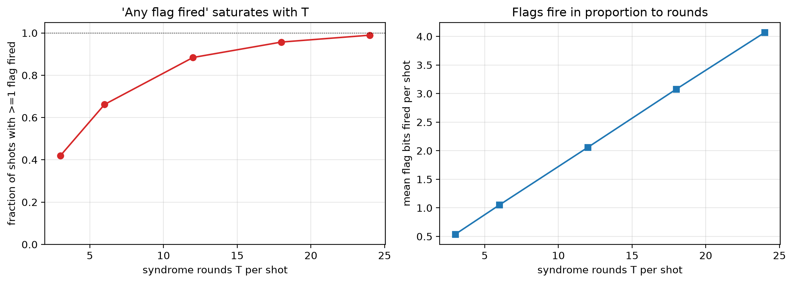

# Experiment 3 flag rate vs rounds — [[46, 2, 9]], p=0.001

Data file: `EXP3_46-2-9_p0.001_flagrate.json`  
Exported: 2026-09-28T11:12:01

A trigger that fires on nearly every shot cannot discriminate; this is the mechanism behind a null result for flag triggering.

## Table: flag_rate

[flag_rate.csv](flag_rate.csv) — 5 rows

| rounds | flag_detectors | fraction_any_flag | mean_flags_per_shot |
|---|---|---|---|
| 3 | 69 | 0.4195 | 0.537 |
| 6 | 138 | 0.662 | 1.051 |
| 12 | 276 | 0.884 | 2.059 |
| 18 | 414 | 0.957 | 3.078 |
| 24 | 552 | 0.9895 | 4.069 |

## Figure: flag_rate_vs_rounds

  
Vector version: [flag_rate_vs_rounds.pdf](flag_rate_vs_rounds.pdf)
