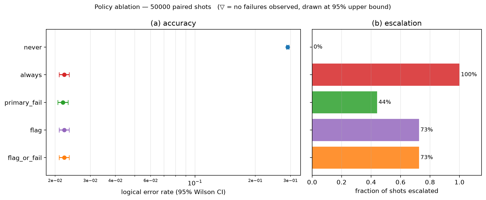
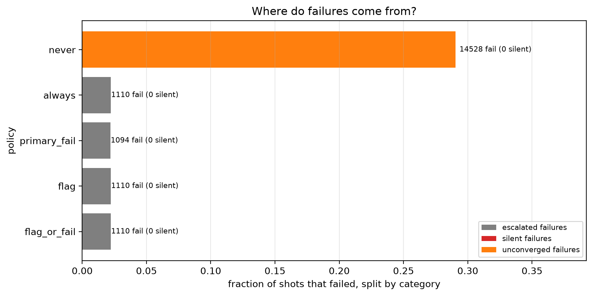
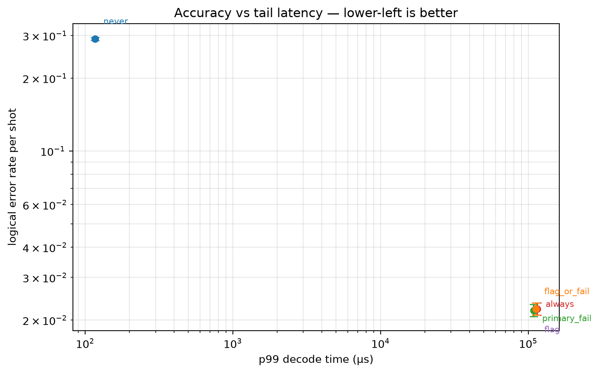
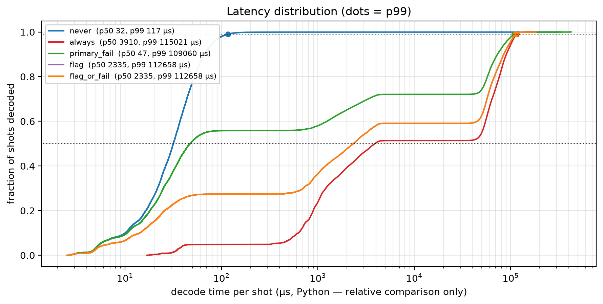

# Experiment 4 — [[46, 2, 9]], T=6, p=0.001, 50000 shots

Data file: `EXP4_46-2-9_T6_p0.001_50000shots_seed20260921_flags_osd4.json`  
Exported: 2026-09-28T11:14:49

## Table: metrics

[metrics.csv](metrics.csv) — 5 rows

| code | rounds | p | shots | seed | use_flags | osd_order | workers | x_detectors | policy | failures | ler | ci_low | ci_high | escalation_rate | silent_failures | unconverged_failures | escalated_failures | work_mean | work_p99 | time_p50_us | time_p99_us |
|---|---|---|---|---|---|---|---|---|---|---|---|---|---|---|---|---|---|---|---|---|---|
| [[46, 2, 9]] | 6 | 0.001 | 50000 | 20260921 | True | 4 | 12 | False | never | 14528 | 0.2906 | 0.2866 | 0.2946 | 0 | 0 | 14528 | 0 | 15.37 | 49 | 31.7 | 116.6 |
| [[46, 2, 9]] | 6 | 0.001 | 50000 | 20260921 | True | 4 | 12 | False | always | 1110 | 0.0222 | 0.02094 | 0.02353 | 1 | 0 | 0 | 1110 | 13.33 | 20 | 3910 | 1.15e+05 |
| [[46, 2, 9]] | 6 | 0.001 | 50000 | 20260921 | True | 4 | 12 | False | primary_fail | 1094 | 0.02188 | 0.02063 | 0.0232 | 0.4411 | 0 | 0 | 1094 | 22.39 | 69 | 47.3 | 1.091e+05 |
| [[46, 2, 9]] | 6 | 0.001 | 50000 | 20260921 | True | 4 | 12 | False | flag | 1110 | 0.0222 | 0.02094 | 0.02353 | 0.7255 | 0 | 0 | 1110 | 13.59 | 41 | 2335 | 1.127e+05 |
| [[46, 2, 9]] | 6 | 0.001 | 50000 | 20260921 | True | 4 | 12 | False | flag_or_fail | 1110 | 0.0222 | 0.02094 | 0.02353 | 0.7255 | 0 | 0 | 1110 | 13.59 | 41 | 2335 | 1.127e+05 |

## Figure: ablation

  
Vector version: [ablation.pdf](ablation.pdf)

## Figure: outcomes

  
Vector version: [outcomes.pdf](outcomes.pdf)

## Figure: tradeoff

  
Vector version: [tradeoff.pdf](tradeoff.pdf)

## Figure: latency

  
Vector version: [latency.pdf](latency.pdf)
