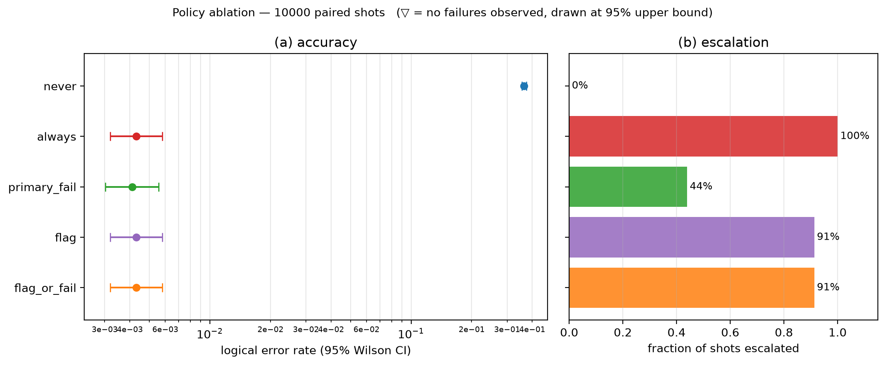
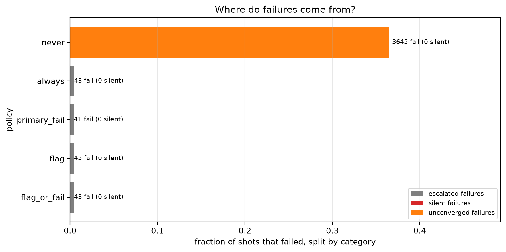
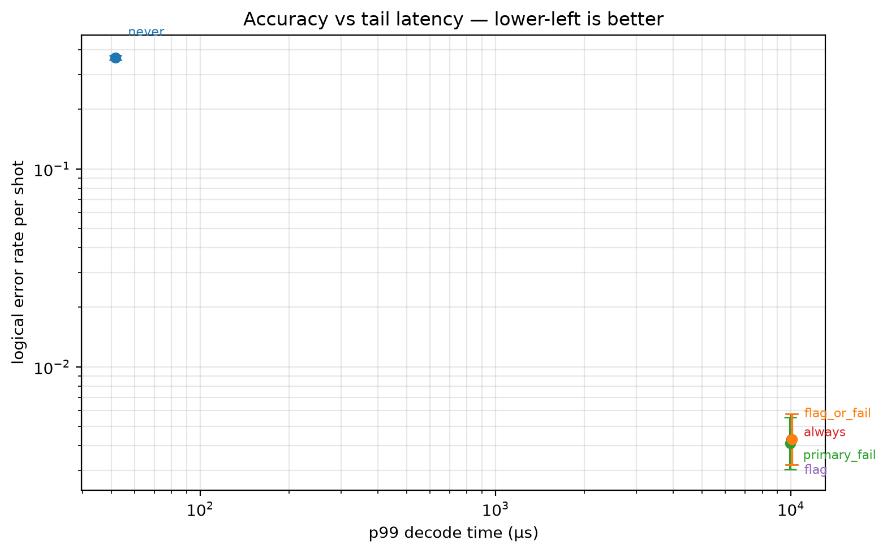
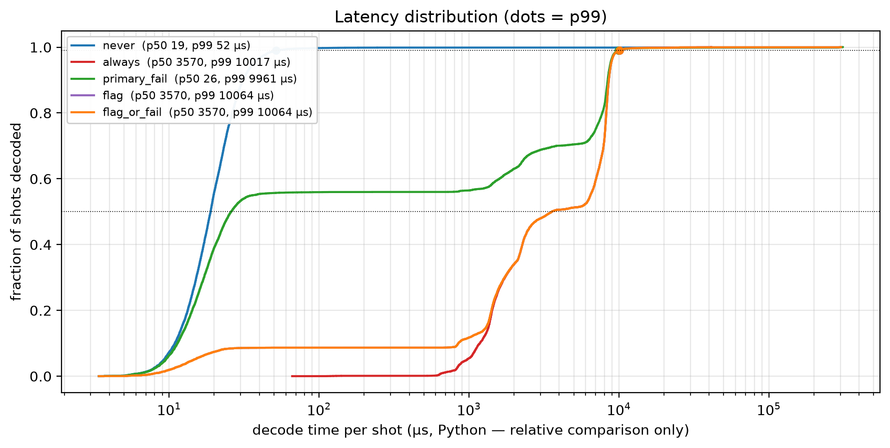

# Experiment 4 — [[72, 12, 6]], T=12, p=0.001, 10000 shots

Data file: `EXP4_72-12-6_T12_p0.001_10000shots_seed20260921_flags_osd0.json`  
Exported: 2026-09-28T03:34:25

## Table: metrics

[metrics.csv](metrics.csv) — 5 rows

| code | rounds | p | shots | seed | use_flags | osd_order | workers | x_detectors | policy | failures | ler | ci_low | ci_high | escalation_rate | silent_failures | unconverged_failures | escalated_failures | work_mean | work_p99 | time_p50_us | time_p99_us |
|---|---|---|---|---|---|---|---|---|---|---|---|---|---|---|---|---|---|---|---|---|---|
| [[72, 12, 6]] | 12 | 0.001 | 10000 | 20260921 | True | 0 | 12 | False | never | 3645 | 0.3645 | 0.3551 | 0.374 | 0 | 0 | 3645 | 0 | 19.67 | 47 | 18.9 | 51.7 |
| [[72, 12, 6]] | 12 | 0.001 | 10000 | 20260921 | True | 0 | 12 | False | always | 43 | 0.0043 | 0.003194 | 0.005787 | 1 | 0 | 0 | 43 | 11.52 | 20 | 3570 | 1.002e+04 |
| [[72, 12, 6]] | 12 | 0.001 | 10000 | 20260921 | True | 0 | 12 | False | primary_fail | 41 | 0.0041 | 0.003024 | 0.005557 | 0.4392 | 0 | 0 | 41 | 26.25 | 67 | 25.9 | 9961 |
| [[72, 12, 6]] | 12 | 0.001 | 10000 | 20260921 | True | 0 | 12 | False | flag | 43 | 0.0043 | 0.003194 | 0.005787 | 0.9129 | 0 | 0 | 43 | 12.67 | 22 | 3570 | 1.006e+04 |
| [[72, 12, 6]] | 12 | 0.001 | 10000 | 20260921 | True | 0 | 12 | False | flag_or_fail | 43 | 0.0043 | 0.003194 | 0.005787 | 0.9129 | 0 | 0 | 43 | 12.67 | 22 | 3570 | 1.006e+04 |

## Figure: ablation

  
Vector version: [ablation.pdf](ablation.pdf)

## Figure: outcomes

  
Vector version: [outcomes.pdf](outcomes.pdf)

## Figure: tradeoff

  
Vector version: [tradeoff.pdf](tradeoff.pdf)

## Figure: latency

  
Vector version: [latency.pdf](latency.pdf)
