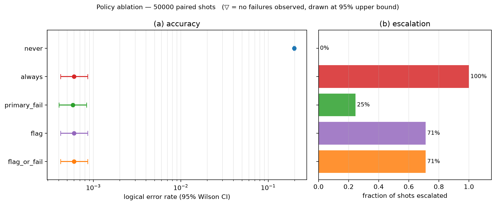
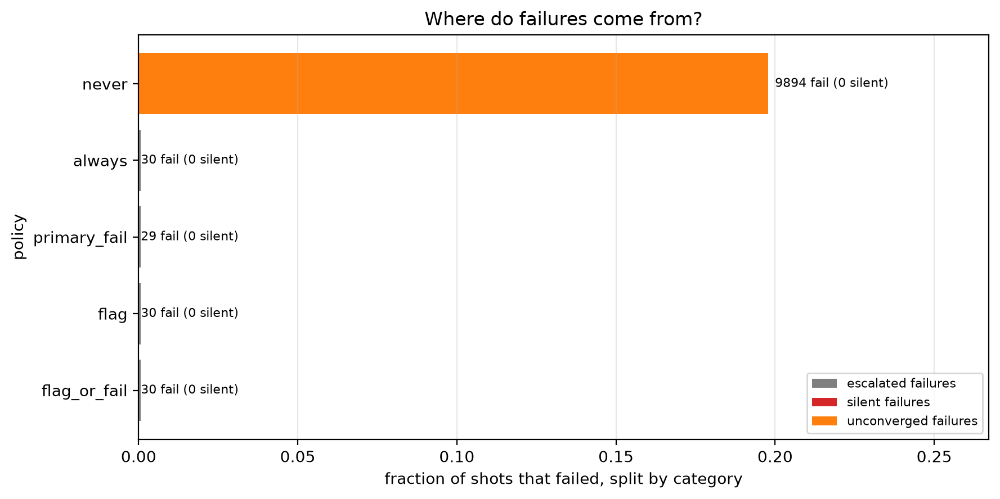
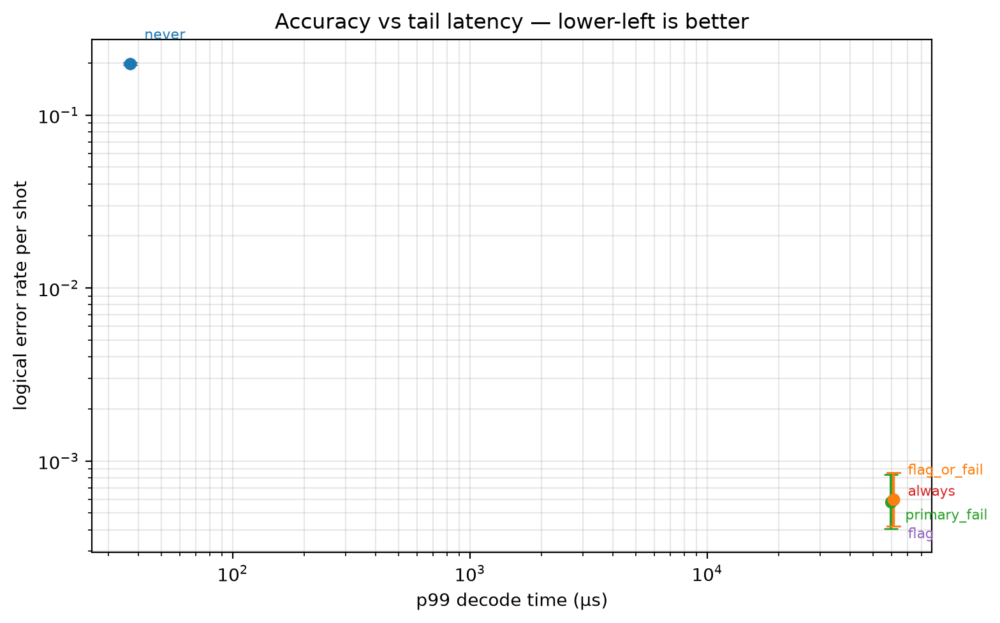
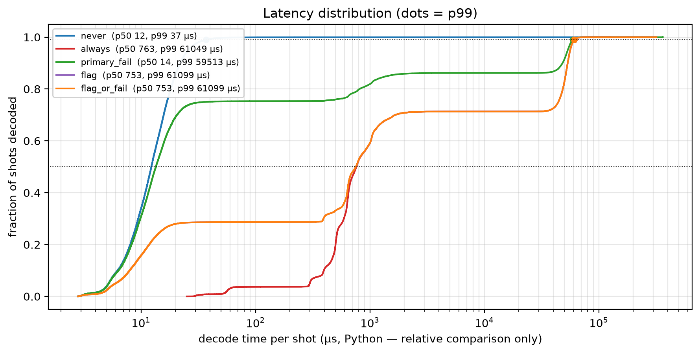

# Experiment 4 — [[72, 12, 6]], T=6, p=0.001, 50000 shots

Data file: `EXP4_72-12-6_T6_p0.001_50000shots_seed20260921_flags_osd4.json`  
Exported: 2026-09-28T10:18:46

## Table: metrics

[metrics.csv](metrics.csv) — 5 rows

| code | rounds | p | shots | seed | use_flags | osd_order | workers | x_detectors | policy | failures | ler | ci_low | ci_high | escalation_rate | silent_failures | unconverged_failures | escalated_failures | work_mean | work_p99 | time_p50_us | time_p99_us |
|---|---|---|---|---|---|---|---|---|---|---|---|---|---|---|---|---|---|---|---|---|---|
| [[72, 12, 6]] | 6 | 0.001 | 50000 | 20260921 | True | 4 | 12 | False | never | 9894 | 0.1979 | 0.1944 | 0.2014 | 0 | 0 | 9894 | 0 | 10.05 | 31 | 12.3 | 37 |
| [[72, 12, 6]] | 6 | 0.001 | 50000 | 20260921 | True | 4 | 12 | False | always | 30 | 0.0006 | 0.0004203 | 0.0008564 | 1 | 0 | 0 | 30 | 7.823 | 20 | 762.8 | 6.105e+04 |
| [[72, 12, 6]] | 6 | 0.001 | 50000 | 20260921 | True | 4 | 12 | False | primary_fail | 29 | 0.00058 | 0.0004039 | 0.0008329 | 0.2465 | 0 | 0 | 29 | 13.29 | 50 | 13.5 | 5.951e+04 |
| [[72, 12, 6]] | 6 | 0.001 | 50000 | 20260921 | True | 4 | 12 | False | flag | 30 | 0.0006 | 0.0004203 | 0.0008564 | 0.713 | 0 | 0 | 30 | 9.146 | 20 | 752.8 | 6.11e+04 |
| [[72, 12, 6]] | 6 | 0.001 | 50000 | 20260921 | True | 4 | 12 | False | flag_or_fail | 30 | 0.0006 | 0.0004203 | 0.0008564 | 0.713 | 0 | 0 | 30 | 9.146 | 20 | 752.8 | 6.11e+04 |

## Figure: ablation

  
Vector version: [ablation.pdf](ablation.pdf)

## Figure: outcomes

  
Vector version: [outcomes.pdf](outcomes.pdf)

## Figure: tradeoff

  
Vector version: [tradeoff.pdf](tradeoff.pdf)

## Figure: latency

  
Vector version: [latency.pdf](latency.pdf)
