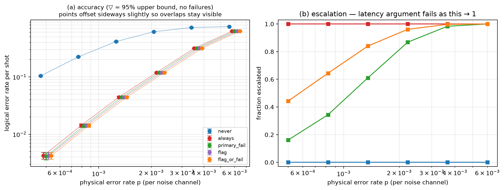

# Experiment 5 — [[46, 2, 9]], T=6, 50000 shots/point

Data file: `EXP5_46-2-9_T6_p0.001_50000shots_seed20260921_flags_osd4.json`  
Exported: 2026-09-28T11:37:59

## Table: sweep_metrics

[sweep_metrics.csv](sweep_metrics.csv) — 30 rows

| p | policy | shots | failures | ler | ci_low | ci_high | escalation_rate | silent_failures | unconverged_failures | escalated_failures | work_mean | work_p99 | time_p50_us | time_p99_us |
|---|---|---|---|---|---|---|---|---|---|---|---|---|---|---|
| 0.0005 | never | 50000 | 5194 | 0.1039 | 0.1012 | 0.1066 | 0 | 0 | 5194 | 0 | 7.494 | 33 | 17.9 | 85 |
| 0.0005 | always | 50000 | 211 | 0.00422 | 0.003689 | 0.004828 | 1 | 0 | 0 | 211 | 10.22 | 20 | 1020 | 1.034e+05 |
| 0.0005 | primary_fail | 50000 | 205 | 0.0041 | 0.003577 | 0.004699 | 0.1618 | 0 | 0 | 205 | 9.858 | 52 | 18.9 | 9.1e+04 |
| 0.0005 | flag | 50000 | 211 | 0.00422 | 0.003689 | 0.004828 | 0.4434 | 0 | 0 | 211 | 7.976 | 33 | 27 | 1.031e+05 |
| 0.0005 | flag_or_fail | 50000 | 211 | 0.00422 | 0.003689 | 0.004828 | 0.4434 | 0 | 0 | 211 | 7.976 | 33 | 27 | 1.031e+05 |
| 0.0008219 | never | 50000 | 11168 | 0.2234 | 0.2197 | 0.227 | 0 | 0 | 11168 | 0 | 12.59 | 44 | 27.2 | 105.3 |
| 0.0008219 | always | 50000 | 710 | 0.0142 | 0.0132 | 0.01528 | 1 | 0 | 0 | 710 | 12.63 | 20 | 2705 | 1.106e+05 |
| 0.0008219 | primary_fail | 50000 | 702 | 0.01404 | 0.01305 | 0.01511 | 0.3441 | 0 | 0 | 702 | 17.93 | 64 | 34.1 | 1.035e+05 |
| 0.0008219 | flag | 50000 | 710 | 0.0142 | 0.0132 | 0.01528 | 0.6442 | 0 | 0 | 710 | 11.97 | 38 | 1320 | 1.088e+05 |
| 0.0008219 | flag_or_fail | 50000 | 710 | 0.0142 | 0.0132 | 0.01528 | 0.6442 | 0 | 0 | 710 | 11.97 | 38 | 1320 | 1.088e+05 |
| 0.001351 | never | 50000 | 20629 | 0.4126 | 0.4083 | 0.4169 | 0 | 0 | 20629 | 0 | 21.06 | 59 | 40.4 | 134.5 |
| 0.001351 | always | 50000 | 2213 | 0.04426 | 0.04249 | 0.0461 | 1 | 0 | 0 | 2213 | 14.75 | 20 | 5.332e+04 | 1.18e+05 |
| 0.001351 | primary_fail | 50000 | 2200 | 0.044 | 0.04224 | 0.04583 | 0.6104 | 0 | 0 | 2200 | 31.17 | 79 | 2100 | 1.144e+05 |
| 0.001351 | flag | 50000 | 2213 | 0.04426 | 0.04249 | 0.0461 | 0.8404 | 0 | 0 | 2213 | 15.91 | 44 | 4.878e+04 | 1.167e+05 |
| 0.001351 | flag_or_fail | 50000 | 2213 | 0.04426 | 0.04249 | 0.0461 | 0.8404 | 0 | 0 | 2213 | 15.91 | 44 | 4.878e+04 | 1.167e+05 |
| 0.002221 | never | 50000 | 30659 | 0.6132 | 0.6089 | 0.6174 | 0 | 0 | 30659 | 0 | 34.99 | 80 | 61.5 | 163.7 |
| 0.002221 | always | 50000 | 5939 | 0.1188 | 0.116 | 0.1216 | 1 | 0 | 0 | 5939 | 16.95 | 20 | 6.168e+04 | 1.179e+05 |
| 0.002221 | primary_fail | 50000 | 5934 | 0.1187 | 0.1159 | 0.1215 | 0.8681 | 0 | 0 | 5934 | 50.29 | 100 | 5.939e+04 | 1.172e+05 |
| 0.002221 | flag | 50000 | 5939 | 0.1188 | 0.116 | 0.1216 | 0.9612 | 0 | 0 | 5939 | 18.43 | 49 | 6.094e+04 | 1.175e+05 |
| 0.002221 | flag_or_fail | 50000 | 5939 | 0.1188 | 0.116 | 0.1216 | 0.9612 | 0 | 0 | 5939 | 18.43 | 49 | 6.094e+04 | 1.175e+05 |
| 0.00365 | never | 50000 | 36277 | 0.7255 | 0.7216 | 0.7294 | 0 | 0 | 36277 | 0 | 56.3 | 105 | 95.6 | 222.2 |
| 0.00365 | always | 50000 | 15754 | 0.3151 | 0.311 | 0.3192 | 1 | 0 | 0 | 15754 | 18.93 | 20 | 7.033e+04 | 1.276e+05 |
| 0.00365 | primary_fail | 50000 | 15752 | 0.315 | 0.311 | 0.3191 | 0.9837 | 0 | 0 | 15752 | 75.01 | 125 | 7.017e+04 | 1.281e+05 |
| 0.00365 | flag | 50000 | 15754 | 0.3151 | 0.311 | 0.3192 | 0.9973 | 0 | 0 | 15754 | 19.67 | 50 | 7.027e+04 | 1.276e+05 |
| 0.00365 | flag_or_fail | 50000 | 15754 | 0.3151 | 0.311 | 0.3192 | 0.9973 | 0 | 0 | 15754 | 19.67 | 50 | 7.027e+04 | 1.276e+05 |
| 0.006 | never | 50000 | 37608 | 0.7522 | 0.7484 | 0.7559 | 0 | 0 | 37608 | 0 | 84.2 | 132 | 130.3 | 236.1 |
| 0.006 | always | 50000 | 31249 | 0.625 | 0.6207 | 0.6292 | 1 | 0 | 0 | 31249 | 19.88 | 20 | 8.353e+04 | 1.524e+05 |
| 0.006 | primary_fail | 50000 | 31249 | 0.625 | 0.6207 | 0.6292 | 0.9998 | 0 | 0 | 31249 | 104.1 | 152 | 8.366e+04 | 1.527e+05 |
| 0.006 | flag | 50000 | 31249 | 0.625 | 0.6207 | 0.6292 | 1 | 0 | 0 | 31249 | 20 | 20 | 8.353e+04 | 1.524e+05 |
| 0.006 | flag_or_fail | 50000 | 31249 | 0.625 | 0.6207 | 0.6292 | 1 | 0 | 0 | 31249 | 20 | 20 | 8.353e+04 | 1.524e+05 |

## Figure: sweep

  
Vector version: [sweep.pdf](sweep.pdf)
