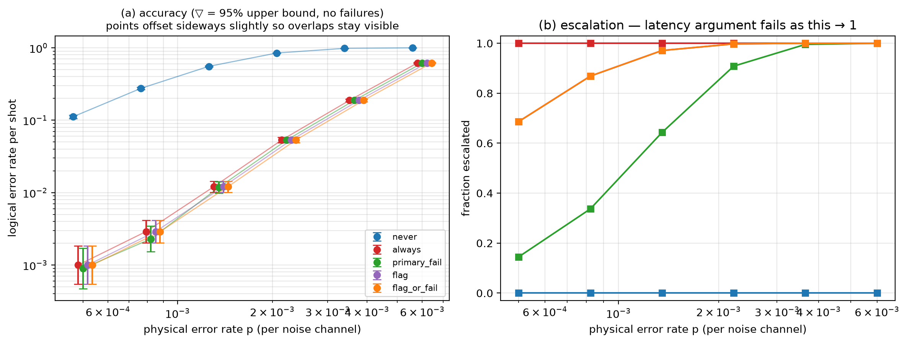

# Experiment 5 — [[72, 12, 6]], T=12, 10000 shots/point

Data file: `EXP5_72-12-6_T12_p0.001_10000shots_seed20260921_flags_osd0.json`  
Exported: 2026-09-28T03:38:48

## Table: sweep_metrics

[sweep_metrics.csv](sweep_metrics.csv) — 30 rows

| p | policy | shots | failures | ler | ci_low | ci_high | escalation_rate | silent_failures | unconverged_failures | escalated_failures | work_mean | work_p99 | time_p50_us | time_p99_us |
|---|---|---|---|---|---|---|---|---|---|---|---|---|---|---|
| 0.0005 | never | 10000 | 1118 | 0.1118 | 0.1058 | 0.1181 | 0 | 0 | 1118 | 0 | 9.685 | 29 | 12.2 | 36.2 |
| 0.0005 | always | 10000 | 10 | 0.001 | 0.0005433 | 0.00184 | 1 | 0 | 0 | 10 | 7.654 | 20 | 1443 | 8916 |
| 0.0005 | primary_fail | 10000 | 9 | 0.0009 | 0.0004736 | 0.00171 | 0.1449 | 0 | 0 | 9 | 11.67 | 48 | 12.7 | 8617 |
| 0.0005 | flag | 10000 | 10 | 0.001 | 0.0005433 | 0.00184 | 0.6866 | 0 | 0 | 10 | 8.894 | 20 | 1417 | 8930 |
| 0.0005 | flag_or_fail | 10000 | 10 | 0.001 | 0.0005433 | 0.00184 | 0.6866 | 0 | 0 | 10 | 8.894 | 20 | 1417 | 8930 |
| 0.0008219 | never | 10000 | 2758 | 0.2758 | 0.2671 | 0.2846 | 0 | 0 | 2758 | 0 | 16.26 | 41 | 19.1 | 50.7 |
| 0.0008219 | always | 10000 | 29 | 0.0029 | 0.00202 | 0.004162 | 1 | 0 | 0 | 29 | 10.32 | 20 | 2940 | 2.118e+04 |
| 0.0008219 | primary_fail | 10000 | 23 | 0.0023 | 0.001533 | 0.003449 | 0.3369 | 0 | 0 | 23 | 21.13 | 61 | 22.4 | 1.527e+04 |
| 0.0008219 | flag | 10000 | 29 | 0.0029 | 0.00202 | 0.004162 | 0.8686 | 0 | 0 | 29 | 11.59 | 20 | 2937 | 2.12e+04 |
| 0.0008219 | flag_or_fail | 10000 | 29 | 0.0029 | 0.00202 | 0.004162 | 0.8686 | 0 | 0 | 29 | 11.59 | 20 | 2937 | 2.12e+04 |
| 0.001351 | never | 10000 | 5547 | 0.5547 | 0.5449 | 0.5644 | 0 | 0 | 5547 | 0 | 26.96 | 59 | 26.1 | 65 |
| 0.001351 | always | 10000 | 121 | 0.0121 | 0.01014 | 0.01444 | 1 | 0 | 0 | 121 | 13.97 | 20 | 6898 | 1.145e+04 |
| 0.001351 | primary_fail | 10000 | 118 | 0.0118 | 0.009863 | 0.01411 | 0.6429 | 0 | 0 | 118 | 37.21 | 78.01 | 3080 | 1.145e+04 |
| 0.001351 | flag | 10000 | 121 | 0.0121 | 0.01014 | 0.01444 | 0.971 | 0 | 0 | 121 | 14.65 | 23 | 6898 | 1.145e+04 |
| 0.001351 | flag_or_fail | 10000 | 121 | 0.0121 | 0.01014 | 0.01444 | 0.971 | 0 | 0 | 121 | 14.65 | 23 | 6898 | 1.145e+04 |
| 0.002221 | never | 10000 | 8474 | 0.8474 | 0.8402 | 0.8543 | 0 | 0 | 8474 | 0 | 44.85 | 83 | 39.5 | 83.7 |
| 0.002221 | always | 10000 | 533 | 0.0533 | 0.04907 | 0.05788 | 1 | 0 | 0 | 533 | 17.03 | 20 | 8113 | 1.603e+04 |
| 0.002221 | primary_fail | 10000 | 531 | 0.0531 | 0.04887 | 0.05767 | 0.9084 | 0 | 0 | 531 | 60.77 | 103 | 8062 | 1.644e+04 |
| 0.002221 | flag | 10000 | 533 | 0.0533 | 0.04907 | 0.05788 | 0.9975 | 0 | 0 | 533 | 17.18 | 20 | 8113 | 1.606e+04 |
| 0.002221 | flag_or_fail | 10000 | 533 | 0.0533 | 0.04907 | 0.05788 | 0.9975 | 0 | 0 | 533 | 17.18 | 20 | 8113 | 1.606e+04 |
| 0.00365 | never | 10000 | 9837 | 0.9837 | 0.981 | 0.986 | 0 | 0 | 9837 | 0 | 74.05 | 122 | 53.8 | 104 |
| 0.00365 | always | 10000 | 1886 | 0.1886 | 0.1811 | 0.1964 | 1 | 0 | 0 | 1886 | 19.12 | 20 | 8909 | 2.494e+04 |
| 0.00365 | primary_fail | 10000 | 1886 | 0.1886 | 0.1811 | 0.1964 | 0.9955 | 0 | 0 | 1886 | 93.1 | 142 | 8963 | 2.569e+04 |
| 0.00365 | flag | 10000 | 1886 | 0.1886 | 0.1811 | 0.1964 | 0.9999 | 0 | 0 | 1886 | 19.13 | 20 | 8909 | 2.494e+04 |
| 0.00365 | flag_or_fail | 10000 | 1886 | 0.1886 | 0.1811 | 0.1964 | 0.9999 | 0 | 0 | 1886 | 19.13 | 20 | 8909 | 2.494e+04 |
| 0.006 | never | 10000 | 9997 | 0.9997 | 0.9991 | 0.9999 | 0 | 0 | 9997 | 0 | 119.5 | 176 | 77.3 | 130.8 |
| 0.006 | always | 10000 | 6170 | 0.617 | 0.6074 | 0.6265 | 1 | 0 | 0 | 6170 | 19.92 | 20 | 1.362e+04 | 5.521e+04 |
| 0.006 | primary_fail | 10000 | 6170 | 0.617 | 0.6074 | 0.6265 | 1 | 0 | 0 | 6170 | 139.4 | 196 | 1.371e+04 | 5.729e+04 |
| 0.006 | flag | 10000 | 6170 | 0.617 | 0.6074 | 0.6265 | 1 | 0 | 0 | 6170 | 19.92 | 20 | 1.362e+04 | 5.521e+04 |
| 0.006 | flag_or_fail | 10000 | 6170 | 0.617 | 0.6074 | 0.6265 | 1 | 0 | 0 | 6170 | 19.92 | 20 | 1.362e+04 | 5.521e+04 |

## Figure: sweep

  
Vector version: [sweep.pdf](sweep.pdf)
