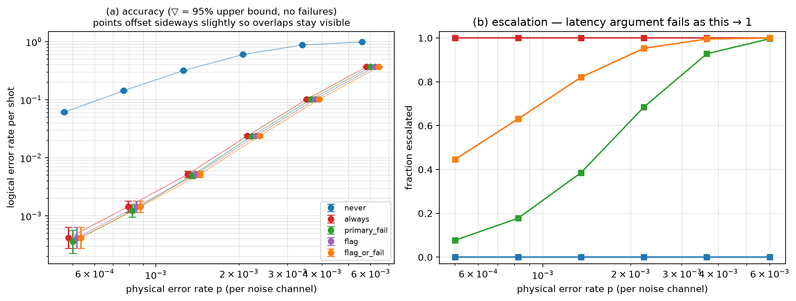

# Experiment 5 — [[72, 12, 6]], T=6, 50000 shots/point

Data file: `EXP5_72-12-6_T6_p0.001_50000shots_seed20260921_flags_osd0.json`  
Exported: 2026-09-28T10:13:25

## Table: sweep_metrics

[sweep_metrics.csv](sweep_metrics.csv) — 30 rows

| p | policy | shots | failures | ler | ci_low | ci_high | escalation_rate | silent_failures | unconverged_failures | escalated_failures | work_mean | work_p99 | time_p50_us | time_p99_us |
|---|---|---|---|---|---|---|---|---|---|---|---|---|---|---|
| 0.0005 | never | 50000 | 3049 | 0.06098 | 0.05892 | 0.06311 | 0 | 0 | 3049 | 0 | 5.029 | 20 | 8.6 | 27.7 |
| 0.0005 | always | 50000 | 21 | 0.00042 | 0.0002747 | 0.000642 | 1 | 0 | 0 | 21 | 5.507 | 20 | 544.4 | 4498 |
| 0.0005 | primary_fail | 50000 | 18 | 0.00036 | 0.0002277 | 0.000569 | 0.07726 | 0 | 0 | 18 | 5.981 | 39 | 8.7 | 4207 |
| 0.0005 | flag | 50000 | 21 | 0.00042 | 0.0002747 | 0.000642 | 0.4466 | 0 | 0 | 21 | 5.755 | 20 | 12.4 | 4503 |
| 0.0005 | flag_or_fail | 50000 | 21 | 0.00042 | 0.0002747 | 0.000642 | 0.4466 | 0 | 0 | 21 | 5.755 | 20 | 12.4 | 4503 |
| 0.0008219 | never | 50000 | 7156 | 0.1431 | 0.1401 | 0.1462 | 0 | 0 | 7156 | 0 | 8.254 | 27 | 10.7 | 34.6 |
| 0.0008219 | always | 50000 | 72 | 0.00144 | 0.001144 | 0.001813 | 1 | 0 | 0 | 72 | 6.951 | 20 | 707.9 | 5237 |
| 0.0008219 | primary_fail | 50000 | 61 | 0.00122 | 0.00095 | 0.001567 | 0.1777 | 0 | 0 | 61 | 10.56 | 47 | 11.3 | 4825 |
| 0.0008219 | flag | 50000 | 72 | 0.00144 | 0.001144 | 0.001813 | 0.6306 | 0 | 0 | 72 | 8.087 | 20 | 693 | 5238 |
| 0.0008219 | flag_or_fail | 50000 | 72 | 0.00144 | 0.001144 | 0.001813 | 0.6306 | 0 | 0 | 72 | 8.087 | 20 | 693 | 5238 |
| 0.001351 | never | 50000 | 15856 | 0.3171 | 0.3131 | 0.3212 | 0 | 0 | 15856 | 0 | 13.7 | 37 | 15.2 | 45.1 |
| 0.001351 | always | 50000 | 260 | 0.0052 | 0.004606 | 0.00587 | 1 | 0 | 0 | 260 | 9.629 | 20 | 1214 | 5299 |
| 0.001351 | primary_fail | 50000 | 248 | 0.00496 | 0.004381 | 0.005615 | 0.3853 | 0 | 0 | 248 | 19.02 | 57 | 18.8 | 5218 |
| 0.001351 | flag | 50000 | 260 | 0.0052 | 0.004606 | 0.00587 | 0.8207 | 0 | 0 | 260 | 11.08 | 21 | 1211 | 5308 |
| 0.001351 | flag_or_fail | 50000 | 260 | 0.0052 | 0.004606 | 0.00587 | 0.8207 | 0 | 0 | 260 | 11.08 | 21 | 1211 | 5308 |
| 0.002221 | never | 50000 | 30015 | 0.6003 | 0.596 | 0.6046 | 0 | 0 | 30015 | 0 | 22.79 | 52 | 21.3 | 54.3 |
| 0.002221 | always | 50000 | 1188 | 0.02376 | 0.02246 | 0.02513 | 1 | 0 | 0 | 1188 | 12.85 | 20 | 2924 | 6604 |
| 0.002221 | primary_fail | 50000 | 1172 | 0.02344 | 0.02215 | 0.0248 | 0.6848 | 0 | 0 | 1172 | 33.03 | 72 | 1424 | 6645 |
| 0.002221 | flag | 50000 | 1188 | 0.02376 | 0.02246 | 0.02513 | 0.9527 | 0 | 0 | 1188 | 13.84 | 26 | 2924 | 6604 |
| 0.002221 | flag_or_fail | 50000 | 1188 | 0.02376 | 0.02246 | 0.02513 | 0.9527 | 0 | 0 | 1188 | 13.84 | 26 | 2924 | 6604 |
| 0.00365 | never | 50000 | 43740 | 0.8748 | 0.8719 | 0.8777 | 0 | 0 | 43740 | 0 | 37.9 | 72 | 31.8 | 72.3 |
| 0.00365 | always | 50000 | 5090 | 0.1018 | 0.09918 | 0.1045 | 1 | 0 | 0 | 5090 | 16.36 | 20 | 4144 | 1.082e+04 |
| 0.00365 | primary_fail | 50000 | 5087 | 0.1017 | 0.09912 | 0.1044 | 0.9279 | 0 | 0 | 5087 | 53.58 | 92 | 4159 | 1.093e+04 |
| 0.00365 | flag | 50000 | 5090 | 0.1018 | 0.09918 | 0.1045 | 0.9954 | 0 | 0 | 5090 | 16.72 | 22 | 4144 | 1.082e+04 |
| 0.00365 | flag_or_fail | 50000 | 5090 | 0.1018 | 0.09918 | 0.1045 | 0.9954 | 0 | 0 | 5090 | 16.72 | 22 | 4144 | 1.082e+04 |
| 0.006 | never | 50000 | 49343 | 0.9869 | 0.9858 | 0.9878 | 0 | 0 | 49343 | 0 | 61.13 | 101 | 43.45 | 79.5 |
| 0.006 | always | 50000 | 18384 | 0.3677 | 0.3635 | 0.3719 | 1 | 0 | 0 | 18384 | 18.99 | 20 | 5033 | 1.848e+04 |
| 0.006 | primary_fail | 50000 | 18384 | 0.3677 | 0.3635 | 0.3719 | 0.9966 | 0 | 0 | 18384 | 80.08 | 121 | 5077 | 1.859e+04 |
| 0.006 | flag | 50000 | 18384 | 0.3677 | 0.3635 | 0.3719 | 0.9999 | 0 | 0 | 18384 | 19.03 | 20 | 5033 | 1.848e+04 |
| 0.006 | flag_or_fail | 50000 | 18384 | 0.3677 | 0.3635 | 0.3719 | 0.9999 | 0 | 0 | 18384 | 19.03 | 20 | 5033 | 1.848e+04 |

## Figure: sweep

  
Vector version: [sweep.pdf](sweep.pdf)
