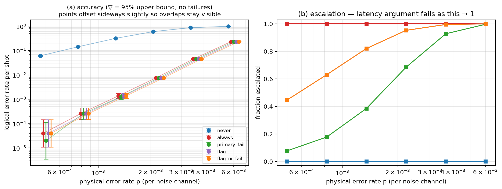

# Experiment 5 — [[72, 12, 6]], T=6, 50000 shots/point

Data file: `EXP5_72-12-6_T6_p0.001_50000shots_seed20260921_flags_osd4.json`  
Exported: 2026-09-28T10:56:00

## Table: sweep_metrics

[sweep_metrics.csv](sweep_metrics.csv) — 30 rows

| p | policy | shots | failures | ler | ci_low | ci_high | escalation_rate | silent_failures | unconverged_failures | escalated_failures | work_mean | work_p99 | time_p50_us | time_p99_us |
|---|---|---|---|---|---|---|---|---|---|---|---|---|---|---|
| 0.0005 | never | 50000 | 3049 | 0.06098 | 0.05892 | 0.06311 | 0 | 0 | 3049 | 0 | 5.029 | 20 | 8 | 25.7 |
| 0.0005 | always | 50000 | 2 | 4e-05 | 1.097e-05 | 0.0001459 | 1 | 0 | 0 | 2 | 5.507 | 20 | 516.5 | 5.856e+04 |
| 0.0005 | primary_fail | 50000 | 1 | 2e-05 | 3.53e-06 | 0.0001133 | 0.07726 | 0 | 0 | 1 | 5.981 | 39 | 8.1 | 5.417e+04 |
| 0.0005 | flag | 50000 | 2 | 4e-05 | 1.097e-05 | 0.0001459 | 0.4466 | 0 | 0 | 2 | 5.755 | 20 | 11.8 | 5.858e+04 |
| 0.0005 | flag_or_fail | 50000 | 2 | 4e-05 | 1.097e-05 | 0.0001459 | 0.4466 | 0 | 0 | 2 | 5.755 | 20 | 11.8 | 5.858e+04 |
| 0.0008219 | never | 50000 | 7156 | 0.1431 | 0.1401 | 0.1462 | 0 | 0 | 7156 | 0 | 8.254 | 27 | 11.4 | 33.8 |
| 0.0008219 | always | 50000 | 13 | 0.00026 | 0.000152 | 0.0004448 | 1 | 0 | 0 | 13 | 6.951 | 20 | 657.8 | 5.971e+04 |
| 0.0008219 | primary_fail | 50000 | 13 | 0.00026 | 0.000152 | 0.0004448 | 0.1777 | 0 | 0 | 13 | 10.56 | 47 | 12 | 5.763e+04 |
| 0.0008219 | flag | 50000 | 13 | 0.00026 | 0.000152 | 0.0004448 | 0.6306 | 0 | 0 | 13 | 8.087 | 20 | 639.9 | 5.973e+04 |
| 0.0008219 | flag_or_fail | 50000 | 13 | 0.00026 | 0.000152 | 0.0004448 | 0.6306 | 0 | 0 | 13 | 8.087 | 20 | 639.9 | 5.973e+04 |
| 0.001351 | never | 50000 | 15856 | 0.3171 | 0.3131 | 0.3212 | 0 | 0 | 15856 | 0 | 13.7 | 37 | 15.1 | 42.7 |
| 0.001351 | always | 50000 | 69 | 0.00138 | 0.001091 | 0.001746 | 1 | 0 | 0 | 69 | 9.629 | 20 | 1180 | 6.203e+04 |
| 0.001351 | primary_fail | 50000 | 64 | 0.00128 | 0.001003 | 0.001634 | 0.3853 | 0 | 0 | 64 | 19.02 | 57 | 18.9 | 6.091e+04 |
| 0.001351 | flag | 50000 | 69 | 0.00138 | 0.001091 | 0.001746 | 0.8207 | 0 | 0 | 69 | 11.08 | 21 | 1179 | 6.204e+04 |
| 0.001351 | flag_or_fail | 50000 | 69 | 0.00138 | 0.001091 | 0.001746 | 0.8207 | 0 | 0 | 69 | 11.08 | 21 | 1179 | 6.204e+04 |
| 0.002221 | never | 50000 | 30015 | 0.6003 | 0.596 | 0.6046 | 0 | 0 | 30015 | 0 | 22.79 | 52 | 21 | 50.4 |
| 0.002221 | always | 50000 | 378 | 0.00756 | 0.006838 | 0.008358 | 1 | 0 | 0 | 378 | 12.85 | 20 | 4.076e+04 | 6.36e+04 |
| 0.002221 | primary_fail | 50000 | 376 | 0.00752 | 0.0068 | 0.008316 | 0.6848 | 0 | 0 | 376 | 33.03 | 72 | 1434 | 6.348e+04 |
| 0.002221 | flag | 50000 | 378 | 0.00756 | 0.006838 | 0.008358 | 0.9527 | 0 | 0 | 378 | 13.84 | 26 | 4.076e+04 | 6.36e+04 |
| 0.002221 | flag_or_fail | 50000 | 378 | 0.00756 | 0.006838 | 0.008358 | 0.9527 | 0 | 0 | 378 | 13.84 | 26 | 4.076e+04 | 6.36e+04 |
| 0.00365 | never | 50000 | 43740 | 0.8748 | 0.8719 | 0.8777 | 0 | 0 | 43740 | 0 | 37.9 | 72 | 30.2 | 63.4 |
| 0.00365 | always | 50000 | 2254 | 0.04508 | 0.0433 | 0.04693 | 1 | 0 | 0 | 2254 | 16.36 | 20 | 5.064e+04 | 6.814e+04 |
| 0.00365 | primary_fail | 50000 | 2254 | 0.04508 | 0.0433 | 0.04693 | 0.9279 | 0 | 0 | 2254 | 53.58 | 92 | 5.026e+04 | 6.826e+04 |
| 0.00365 | flag | 50000 | 2254 | 0.04508 | 0.0433 | 0.04693 | 0.9954 | 0 | 0 | 2254 | 16.72 | 22 | 5.064e+04 | 6.814e+04 |
| 0.00365 | flag_or_fail | 50000 | 2254 | 0.04508 | 0.0433 | 0.04693 | 0.9954 | 0 | 0 | 2254 | 16.72 | 22 | 5.064e+04 | 6.814e+04 |
| 0.006 | never | 50000 | 49343 | 0.9869 | 0.9858 | 0.9878 | 0 | 0 | 49343 | 0 | 61.13 | 101 | 43.5 | 79.8 |
| 0.006 | always | 50000 | 11603 | 0.2321 | 0.2284 | 0.2358 | 1 | 0 | 0 | 11603 | 18.99 | 20 | 5.6e+04 | 7.379e+04 |
| 0.006 | primary_fail | 50000 | 11603 | 0.2321 | 0.2284 | 0.2358 | 0.9966 | 0 | 0 | 11603 | 80.08 | 121 | 5.604e+04 | 7.391e+04 |
| 0.006 | flag | 50000 | 11603 | 0.2321 | 0.2284 | 0.2358 | 0.9999 | 0 | 0 | 11603 | 19.03 | 20 | 5.6e+04 | 7.379e+04 |
| 0.006 | flag_or_fail | 50000 | 11603 | 0.2321 | 0.2284 | 0.2358 | 0.9999 | 0 | 0 | 11603 | 19.03 | 20 | 5.6e+04 | 7.379e+04 |

## Figure: sweep

  
Vector version: [sweep.pdf](sweep.pdf)
