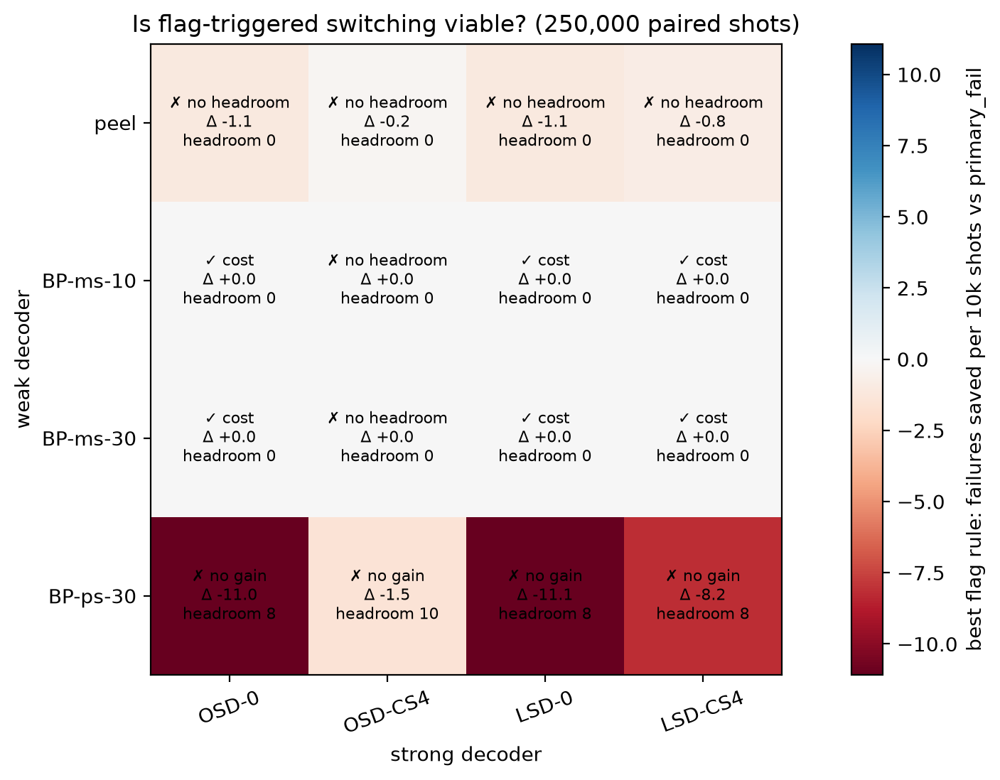
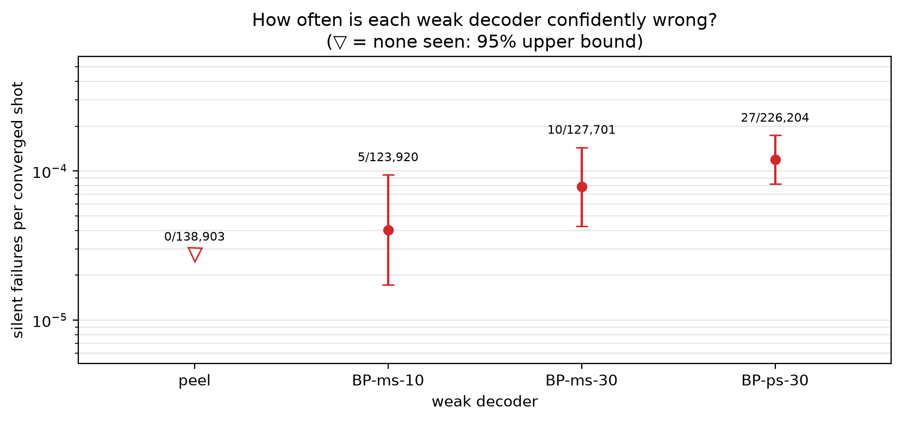
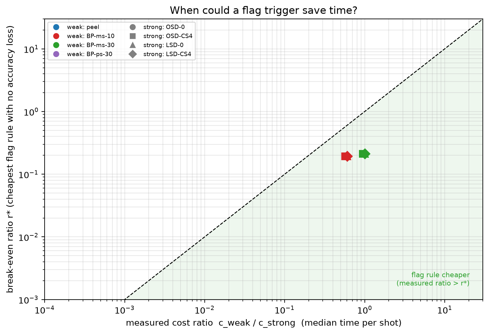
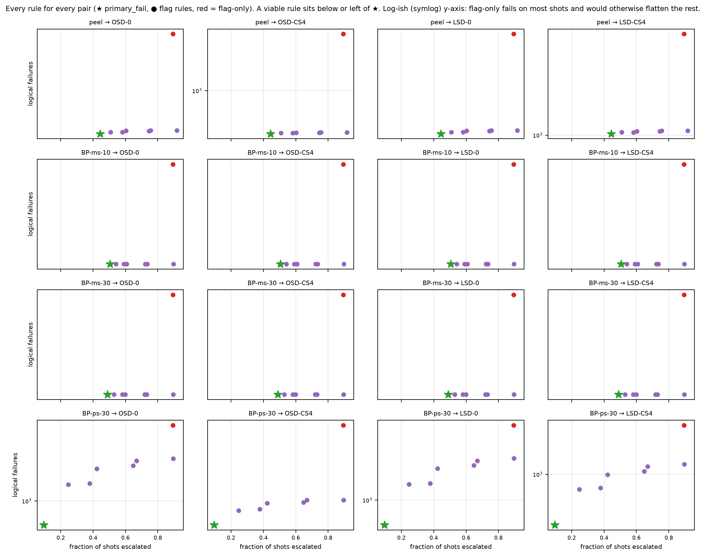

# Experiment 6 decoder zoo — 250,000 shots

Data file: `EXP6_72-12-6_T12_p0.001_250000shots_seed20260922.npz`  
Exported: 2026-09-28T04:46:01

Verdict counts: not viable: 10, viable: cost: 6

## Table: verdicts

[verdicts.csv](verdicts.csv) — 16 rows

| weak | strong | verdict | verdict_accuracy | verdict_cost | headroom | min_detectable_discordant | pf_failures | pf_escalation | pf_cost_us | always_failures | best_accuracy_rule | best_cost_rule | best_saving | cost_ratio |
|---|---|---|---|---|---|---|---|---|---|---|---|---|---|---|
| peel | OSD-0 | not viable | impossible: no headroom | not viable | 0 | 6 | 1279 | 0.4444 | 3334 | 1345 | None | None | 0 | 0.00556 |
| peel | OSD-CS4 | not viable | impossible: no headroom | not viable | 0 | 6 | 308 | 0.4444 | 5.942e+04 | 318 | None | None | 0 | 0.005259 |
| peel | LSD-0 | not viable | impossible: no headroom | not viable | 0 | 6 | 1276 | 0.4444 | 3021 | 1342 | None | None | 0 | 0.005607 |
| peel | LSD-CS4 | not viable | impossible: no headroom | not viable | 0 | 6 | 1024 | 0.4444 | 3142 | 1077 | None | None | 0 | 0.005596 |
| BP-ms-10 | OSD-0 | viable: cost | impossible: no headroom | viable: cost | 0 | 6 | 1345 | 0.5043 | 7426 | 1345 | None | flag>=1 | 0.2224 | 0.6011 |
| BP-ms-10 | OSD-CS4 | not viable | impossible: no headroom | not viable | 0 | 6 | 318 | 0.5043 | 9.983e+04 | 318 | None | None | 0.01573 | 0.5686 |
| BP-ms-10 | LSD-0 | viable: cost | impossible: no headroom | viable: cost | 0 | 6 | 1342 | 0.5043 | 6875 | 1342 | None | flag>=1 | 0.2413 | 0.6062 |
| BP-ms-10 | LSD-CS4 | viable: cost | impossible: no headroom | viable: cost | 0 | 6 | 1077 | 0.5043 | 7063 | 1077 | None | flag>=1 | 0.235 | 0.605 |
| BP-ms-30 | OSD-0 | viable: cost | impossible: no headroom | viable: cost | 0 | 6 | 1345 | 0.4892 | 9849 | 1345 | None | flag>=1 | 0.4127 | 0.9986 |
| BP-ms-30 | OSD-CS4 | not viable | impossible: no headroom | not viable | 0 | 6 | 318 | 0.4892 | 1.022e+05 | 318 | None | None | 0.03893 | 0.9446 |
| BP-ms-30 | LSD-0 | viable: cost | impossible: no headroom | viable: cost | 0 | 6 | 1342 | 0.4892 | 9298 | 1342 | None | flag>=1 | 0.438 | 1.007 |
| BP-ms-30 | LSD-CS4 | viable: cost | impossible: no headroom | viable: cost | 0 | 6 | 1077 | 0.4892 | 9486 | 1077 | None | flag>=1 | 0.4294 | 1.005 |
| BP-ps-30 | OSD-0 | not viable | not viable | not viable | 8 | 6 | 846 | 0.09518 | 1.157e+04 | 1345 | None | None | 0 | 2.076 |
| BP-ps-30 | OSD-CS4 | not viable | not viable | not viable | 10 | 6 | 248 | 0.09518 | 2.893e+04 | 318 | None | None | 0 | 1.964 |
| BP-ps-30 | LSD-0 | not viable | not viable | not viable | 8 | 6 | 840 | 0.09518 | 1.149e+04 | 1342 | None | None | 0 | 2.094 |
| BP-ps-30 | LSD-CS4 | not viable | not viable | not viable | 8 | 6 | 693 | 0.09518 | 1.153e+04 | 1077 | None | None | 0 | 2.09 |

## Table: weak_decoders

[weak_decoders.csv](weak_decoders.csv) — 4 rows

| weak | converged | silent | silent_rate | silent_rate_upper | silent_on_flagged | median_time_us |
|---|---|---|---|---|---|---|
| peel | 138903 | 0 | 0 | 2.766e-05 | 0 | 22.5 |
| BP-ms-10 | 123920 | 5 | 4.035e-05 | 9.446e-05 | 4 | 2433 |
| BP-ms-30 | 127701 | 10 | 7.831e-05 | 0.0001442 | 7 | 4041 |
| BP-ps-30 | 226204 | 27 | 0.0001194 | 0.0001737 | 22 | 8402 |

## Table: all_rules

[all_rules.csv](all_rules.csv) — 128 rows

## Table: flag_diagnostics

[flag_diagnostics.csv](flag_diagnostics.csv) — 8 rows

| decoder | flagged_fraction | error_rate_flagged | error_rate_unflagged | risk_ratio | mutual_information_bits | share_of_failures_on_flagged |
|---|---|---|---|---|---|---|
| peel | 0.8934 | 0.3932 | 0.1649 | 2.385 | 0.01718 | 0.9524 |
| BP-ms-10 | 0.8934 | 0.4175 | 0.01842 | 22.66 | 0.0645 | 0.9948 |
| BP-ms-30 | 0.8934 | 0.4059 | 0.01587 | 25.57 | 0.06324 | 0.9954 |
| BP-ps-30 | 0.8934 | 0.07986 | 0.01343 | 5.945 | 0.006387 | 0.9803 |
| OSD-0 | 0.8934 | 0.005991 | 0.0002627 | 22.81 | 0.0007103 | 0.9948 |
| OSD-CS4 | 0.8934 | 0.001397 | 0.0002251 | 6.205 | 0.0001088 | 0.9811 |
| LSD-0 | 0.8934 | 0.005977 | 0.0002627 | 22.76 | 0.0007085 | 0.9948 |
| LSD-CS4 | 0.8934 | 0.004791 | 0.0002627 | 18.24 | 0.0005442 | 0.9935 |

## Table: strong_ceiling

[strong_ceiling.csv](strong_ceiling.csv) — 12 rows

| decoder | compared_with | failures | fixed_by_other | broken_by_other |
|---|---|---|---|---|
| OSD-0 | OSD-CS4 | 1345 | 1031 | 4 |
| OSD-0 | LSD-0 | 1345 | 9 | 6 |
| OSD-0 | LSD-CS4 | 1345 | 278 | 10 |
| OSD-CS4 | OSD-0 | 318 | 4 | 1031 |
| OSD-CS4 | LSD-0 | 318 | 7 | 1031 |
| OSD-CS4 | LSD-CS4 | 318 | 22 | 781 |
| LSD-0 | OSD-0 | 1342 | 6 | 9 |
| LSD-0 | OSD-CS4 | 1342 | 1031 | 7 |
| LSD-0 | LSD-CS4 | 1342 | 274 | 9 |
| LSD-CS4 | OSD-0 | 1077 | 10 | 278 |
| LSD-CS4 | OSD-CS4 | 1077 | 781 | 22 |
| LSD-CS4 | LSD-0 | 1077 | 9 | 274 |

## Figure: verdicts

  
Vector version: [verdicts.pdf](verdicts.pdf)

## Figure: silent_failures

  
Vector version: [silent_failures.pdf](silent_failures.pdf)

## Figure: breakeven

  
Vector version: [breakeven.pdf](breakeven.pdf)

## Figure: tradeoffs

  
Vector version: [tradeoffs.pdf](tradeoffs.pdf)
