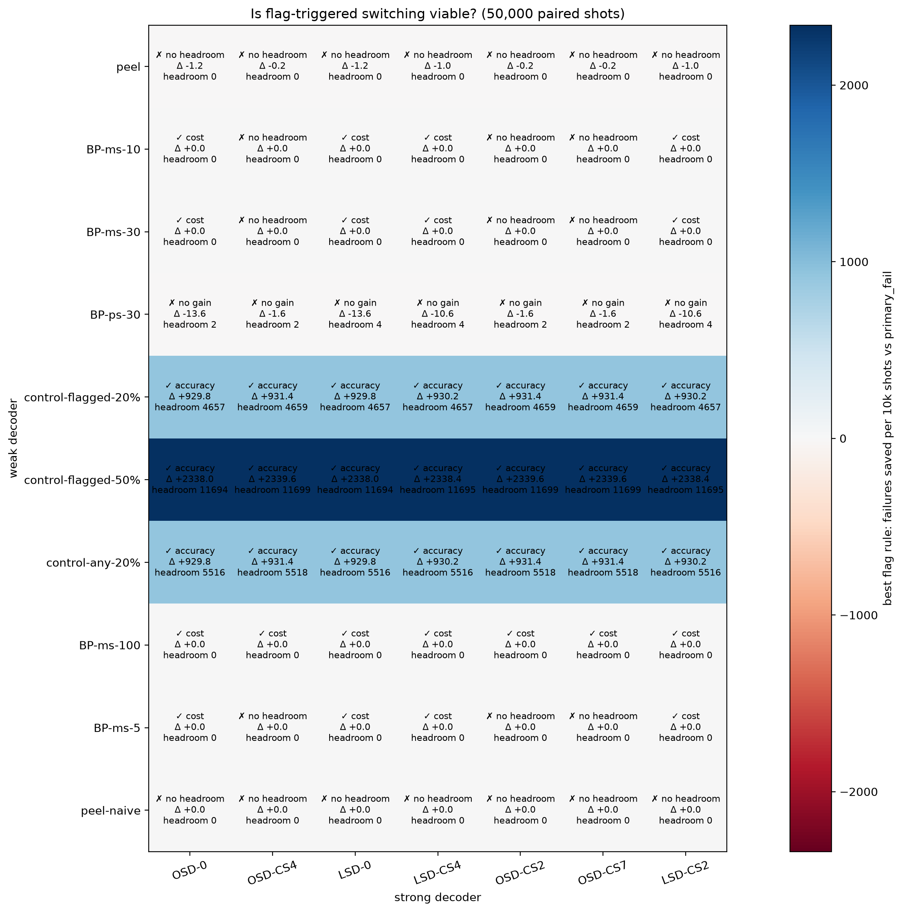
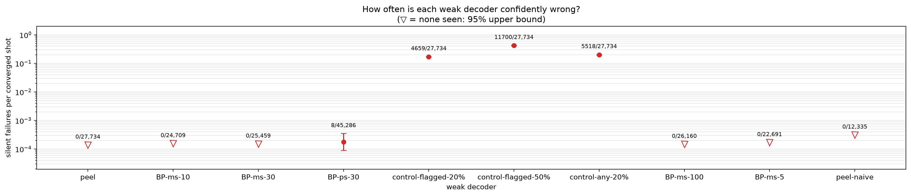
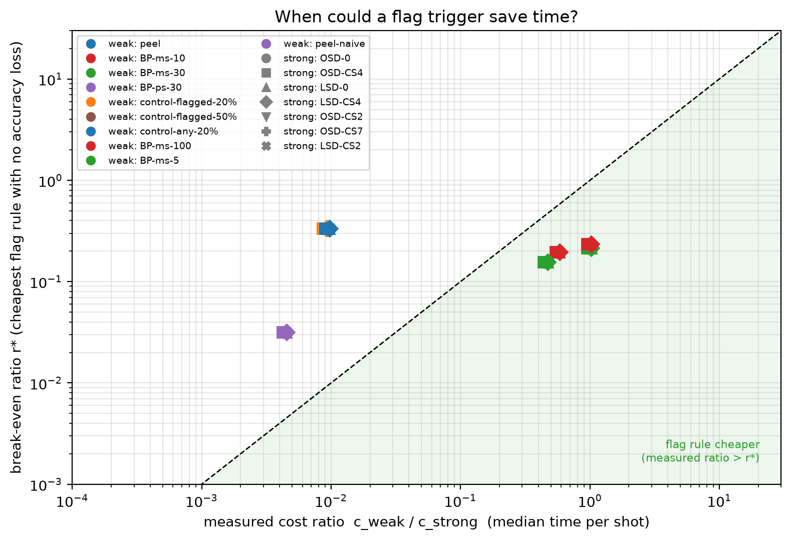
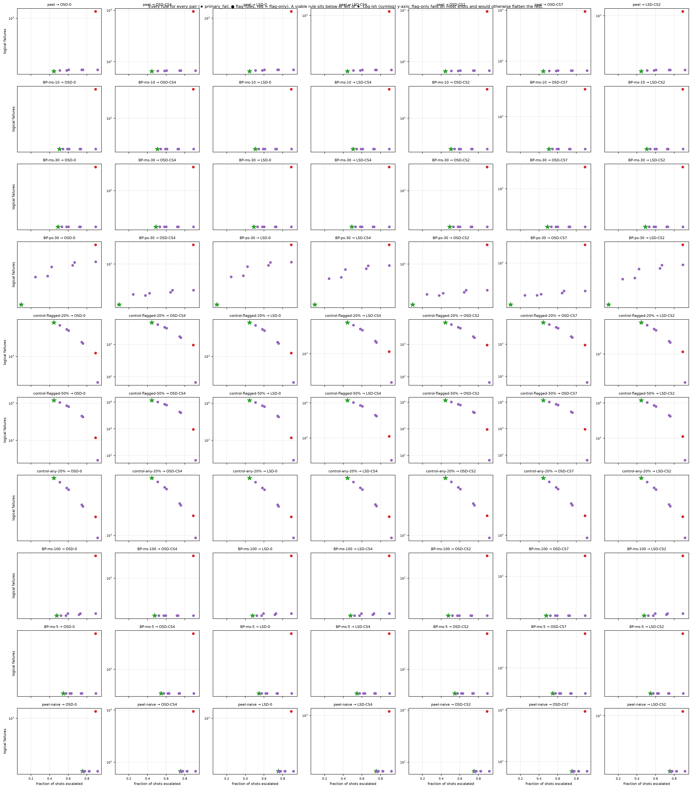

# Experiment 6 decoder zoo — 50,000 shots

Data file: `EXP6_72-12-6_T12_p0.001_50000shots_seed20260922.npz`  
Exported: 2026-09-28T05:12:36

Verdict counts: not viable: 30, viable: accuracy: 21, viable: cost: 19

## Table: verdicts

[verdicts.csv](verdicts.csv) — 70 rows

## Table: weak_decoders

[weak_decoders.csv](weak_decoders.csv) — 10 rows

| weak | converged | silent | silent_rate | silent_rate_upper | silent_on_flagged | median_time_us |
|---|---|---|---|---|---|---|
| peel | 27734 | 0 | 0 | 0.0001385 | 0 | 22.8 |
| BP-ms-10 | 24709 | 0 | 0 | 0.0001554 | 0 | 2460 |
| BP-ms-30 | 25459 | 0 | 0 | 0.0001509 | 0 | 4327 |
| BP-ps-30 | 45286 | 8 | 0.0001767 | 0.0003486 | 7 | 8278 |
| control-flagged-20% | 27734 | 4659 | 0.168 | 0.1724 | 4659 | 39 |
| control-flagged-50% | 27734 | 11700 | 0.4219 | 0.4277 | 11700 | 40.8 |
| control-any-20% | 27734 | 5518 | 0.199 | 0.2037 | 4659 | 41.1 |
| BP-ms-100 | 26160 | 0 | 0 | 0.0001468 | 0 | 4302 |
| BP-ms-5 | 22691 | 0 | 0 | 0.0001693 | 0 | 1994 |
| peel-naive | 12335 | 0 | 0 | 0.0003113 | 0 | 19.1 |

## Table: all_rules

[all_rules.csv](all_rules.csv) — 560 rows

## Table: flag_diagnostics

[flag_diagnostics.csv](flag_diagnostics.csv) — 17 rows

| decoder | flagged_fraction | error_rate_flagged | error_rate_unflagged | risk_ratio | mutual_information_bits | share_of_failures_on_flagged |
|---|---|---|---|---|---|---|
| peel | 0.892 | 0.3947 | 0.1631 | 2.42 | 0.01789 | 0.9523 |
| BP-ms-10 | 0.892 | 0.4183 | 0.01462 | 28.6 | 0.0676 | 0.9958 |
| BP-ms-30 | 0.892 | 0.4067 | 0.01166 | 34.88 | 0.06666 | 0.9965 |
| BP-ps-30 | 0.892 | 0.07991 | 0.01222 | 6.541 | 0.006814 | 0.9818 |
| control-flagged-20% | 0.892 | 0.4991 | 0.1631 | 3.061 | 0.03473 | 0.9619 |
| control-flagged-50% | 0.892 | 0.657 | 0.1631 | 4.029 | 0.07203 | 0.9708 |
| control-any-20% | 0.892 | 0.4991 | 0.3221 | 1.55 | 0.008935 | 0.9275 |
| BP-ms-100 | 0.892 | 0.3958 | 0.01111 | 35.64 | 0.06447 | 0.9966 |
| BP-ms-5 | 0.892 | 0.5209 | 0.0211 | 24.68 | 0.09004 | 0.9951 |
| peel-naive | 0.892 | 0.6632 | 0.1631 | 4.067 | 0.07388 | 0.9711 |
| OSD-0 | 0.892 | 0.006592 | 0 | inf | 0.0009729 | 1 |
| OSD-CS4 | 0.892 | 0.001502 | 0 | inf | 0.0002212 | 1 |
| LSD-0 | 0.892 | 0.00657 | 0 | inf | 0.0009696 | 1 |
| LSD-CS4 | 0.892 | 0.005224 | 0 | inf | 0.0007706 | 1 |
| OSD-CS2 | 0.892 | 0.001502 | 0 | inf | 0.0002212 | 1 |
| OSD-CS7 | 0.892 | 0.001457 | 0 | inf | 0.0002146 | 1 |
| LSD-CS2 | 0.892 | 0.005359 | 0 | inf | 0.0007905 | 1 |

## Table: strong_ceiling

[strong_ceiling.csv](strong_ceiling.csv) — 42 rows

## Figure: verdicts

  
Vector version: [verdicts.pdf](verdicts.pdf)

## Figure: silent_failures

  
Vector version: [silent_failures.pdf](silent_failures.pdf)

## Figure: breakeven

  
Vector version: [breakeven.pdf](breakeven.pdf)

## Figure: tradeoffs

  
Vector version: [tradeoffs.pdf](tradeoffs.pdf)
