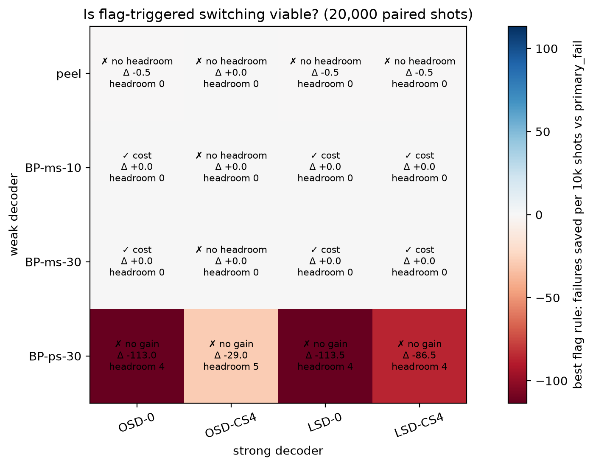
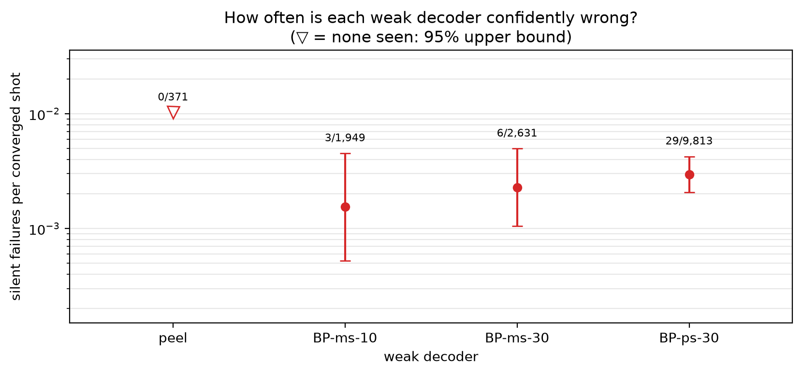
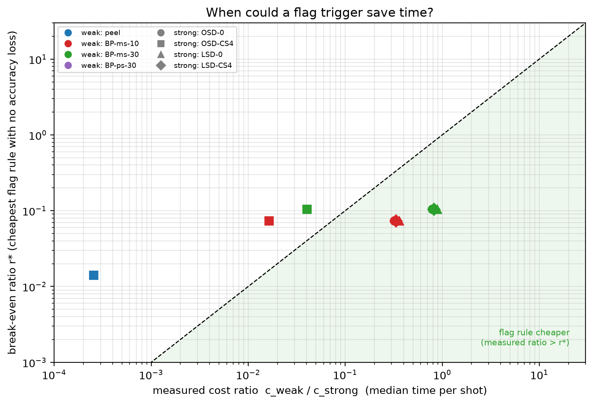
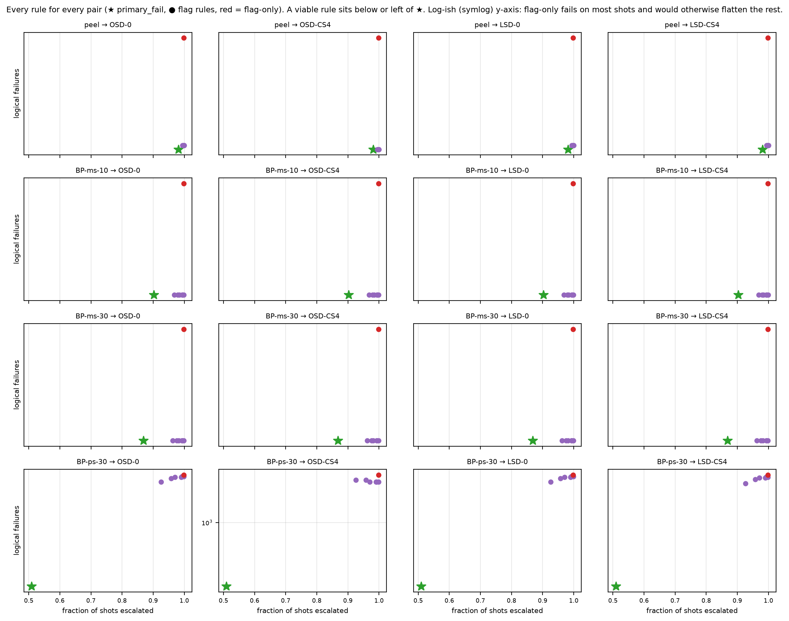

# Experiment 6 decoder zoo — 20,000 shots

Data file: `EXP6_72-12-6_T12_p0.003_20000shots_seed20260922.npz`  
Exported: 2026-09-29T20:42:50

Verdict counts: not viable: 10, viable: cost: 6

## Table: verdicts

[verdicts.csv](verdicts.csv) — 16 rows

| weak | strong | verdict | verdict_accuracy | verdict_cost | headroom | min_detectable_discordant | pf_failures | pf_escalation | pf_cost_us | always_failures | best_accuracy_rule | best_cost_rule | best_saving | cost_ratio |
|---|---|---|---|---|---|---|---|---|---|---|---|---|---|---|
| peel | OSD-0 | not viable | impossible: no headroom | not viable | 0 | 6 | 2379 | 0.9815 | 9284 | 2380 | None | None | 0 | 0.004965 |
| peel | OSD-CS4 | not viable | impossible: no headroom | not viable | 0 | 6 | 1023 | 0.9815 | 1.674e+05 | 1023 | None | None | -0.007841 | 0.0002539 |
| peel | LSD-0 | not viable | impossible: no headroom | not viable | 0 | 6 | 2361 | 0.9815 | 9859 | 2362 | None | None | 0 | 0.005607 |
| peel | LSD-CS4 | not viable | impossible: no headroom | not viable | 0 | 6 | 1919 | 0.9815 | 1.04e+04 | 1920 | None | None | 0 | 0.005152 |
| BP-ms-10 | OSD-0 | viable: cost | impossible: no headroom | viable: cost | 0 | 6 | 2380 | 0.9025 | 1.199e+04 | 2380 | None | flag>=1 | 0.229 | 0.3201 |
| BP-ms-10 | OSD-CS4 | not viable | impossible: no headroom | not viable | 0 | 6 | 1023 | 0.9025 | 1.718e+05 | 1023 | None | None | 0.01581 | 0.01637 |
| BP-ms-10 | LSD-0 | viable: cost | impossible: no headroom | viable: cost | 0 | 6 | 2362 | 0.9025 | 1.256e+04 | 2362 | None | flag>=1 | 0.2192 | 0.3615 |
| BP-ms-10 | LSD-CS4 | viable: cost | impossible: no headroom | viable: cost | 0 | 6 | 1920 | 0.9025 | 1.31e+04 | 1920 | None | flag>=1 | 0.2099 | 0.3322 |
| BP-ms-30 | OSD-0 | viable: cost | impossible: no headroom | viable: cost | 0 | 6 | 2380 | 0.8685 | 1.582e+04 | 2380 | None | flag>=1 | 0.4154 | 0.7868 |
| BP-ms-30 | OSD-CS4 | not viable | impossible: no headroom | not viable | 0 | 6 | 1023 | 0.8685 | 1.756e+05 | 1023 | None | None | 0.0372 | 0.04025 |
| BP-ms-30 | LSD-0 | viable: cost | impossible: no headroom | viable: cost | 0 | 6 | 2362 | 0.8685 | 1.639e+04 | 2362 | None | flag>=1 | 0.4015 | 0.8887 |
| BP-ms-30 | LSD-CS4 | viable: cost | impossible: no headroom | viable: cost | 0 | 6 | 1920 | 0.8685 | 1.693e+04 | 1920 | None | flag>=1 | 0.3884 | 0.8166 |
| BP-ps-30 | OSD-0 | not viable | not viable | not viable | 4 | 6 | 2142 | 0.5093 | 2.746e+04 | 2380 | None | None | 0 | 2.503 |
| BP-ps-30 | OSD-CS4 | not viable | not viable | not viable | 5 | 6 | 965 | 0.5093 | 1.21e+05 | 1023 | None | None | 0 | 0.128 |
| BP-ps-30 | LSD-0 | not viable | not viable | not viable | 4 | 6 | 2123 | 0.5093 | 2.83e+04 | 2362 | None | None | 0 | 2.827 |
| BP-ps-30 | LSD-CS4 | not viable | not viable | not viable | 4 | 6 | 1736 | 0.5093 | 2.861e+04 | 1920 | None | None | 0 | 2.598 |

## Table: weak_decoders

[weak_decoders.csv](weak_decoders.csv) — 4 rows

| weak | converged | silent | silent_rate | silent_rate_upper | silent_on_flagged | median_time_us |
|---|---|---|---|---|---|---|
| peel | 371 | 0 | 0 | 0.01025 | 0 | 48 |
| BP-ms-10 | 1949 | 3 | 0.001539 | 0.004516 | 3 | 3094 |
| BP-ms-30 | 2631 | 6 | 0.002281 | 0.004967 | 6 | 7607 |
| BP-ps-30 | 9813 | 29 | 0.002955 | 0.004241 | 29 | 2.42e+04 |

## Table: all_rules

[all_rules.csv](all_rules.csv) — 128 rows

## Table: flag_diagnostics

[flag_diagnostics.csv](flag_diagnostics.csv) — 8 rows

| decoder | flagged_fraction | error_rate_flagged | error_rate_unflagged | risk_ratio | mutual_information_bits | share_of_failures_on_flagged |
|---|---|---|---|---|---|---|
| peel | 0.9983 | 0.9535 | 0.7941 | 1.201 | 0.0003936 | 0.9986 |
| BP-ms-10 | 0.9983 | 0.8035 | 0.2647 | 3.035 | 0.001655 | 0.9994 |
| BP-ms-30 | 0.9983 | 0.7662 | 0.1765 | 4.342 | 0.001903 | 0.9996 |
| BP-ps-30 | 0.9983 | 0.4296 | 0.1176 | 3.651 | 0.0005695 | 0.9995 |
| OSD-0 | 0.9983 | 0.1192 | 0 | inf | 0.000311 | 1 |
| OSD-CS4 | 0.9983 | 0.05124 | 0 | inf | 0.0001289 | 1 |
| LSD-0 | 0.9983 | 0.1183 | 0 | inf | 0.0003085 | 1 |
| LSD-CS4 | 0.9983 | 0.09616 | 0 | inf | 0.0002478 | 1 |

## Table: strong_ceiling

[strong_ceiling.csv](strong_ceiling.csv) — 12 rows

| decoder | compared_with | failures | fixed_by_other | broken_by_other |
|---|---|---|---|---|
| OSD-0 | OSD-CS4 | 2380 | 1376 | 19 |
| OSD-0 | LSD-0 | 2380 | 36 | 18 |
| OSD-0 | LSD-CS4 | 2380 | 479 | 19 |
| OSD-CS4 | OSD-0 | 1023 | 19 | 1376 |
| OSD-CS4 | LSD-0 | 1023 | 24 | 1363 |
| OSD-CS4 | LSD-CS4 | 1023 | 82 | 979 |
| LSD-0 | OSD-0 | 2362 | 18 | 36 |
| LSD-0 | OSD-CS4 | 2362 | 1363 | 24 |
| LSD-0 | LSD-CS4 | 2362 | 459 | 17 |
| LSD-CS4 | OSD-0 | 1920 | 19 | 479 |
| LSD-CS4 | OSD-CS4 | 1920 | 979 | 82 |
| LSD-CS4 | LSD-0 | 1920 | 17 | 459 |

## Figure: verdicts

  
Vector version: [verdicts.pdf](verdicts.pdf)

## Figure: silent_failures

  
Vector version: [silent_failures.pdf](silent_failures.pdf)

## Figure: breakeven

  
Vector version: [breakeven.pdf](breakeven.pdf)

## Figure: tradeoffs

  
Vector version: [tradeoffs.pdf](tradeoffs.pdf)
