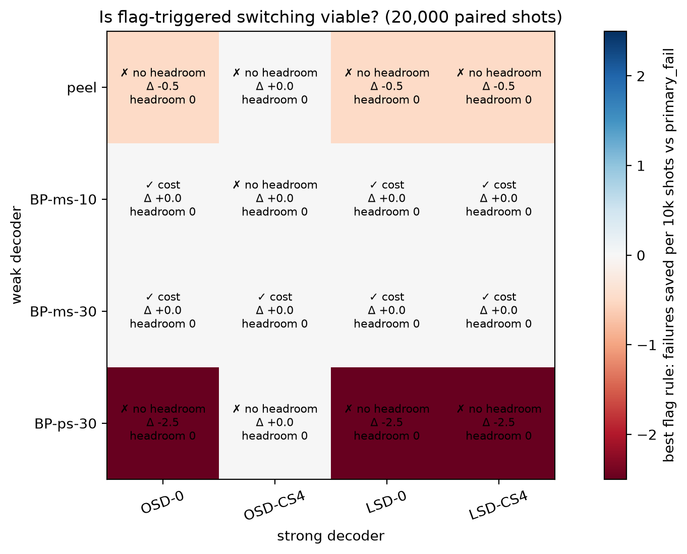
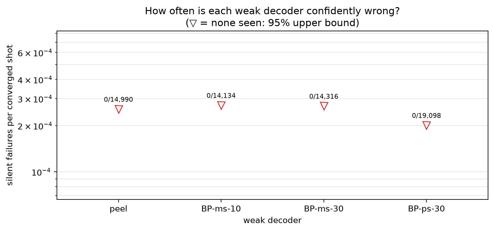
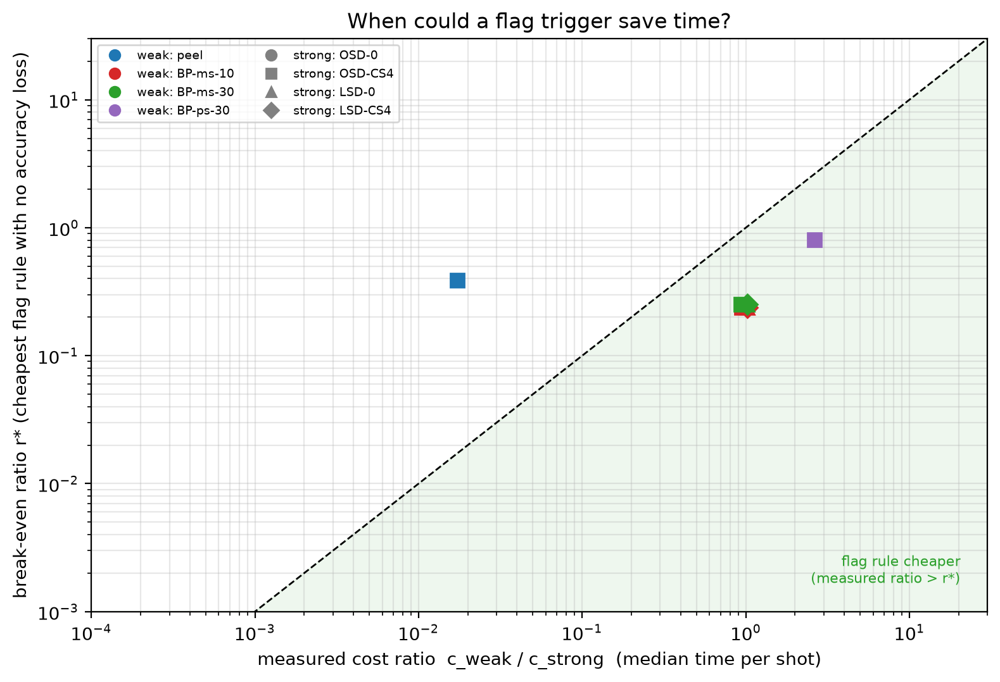
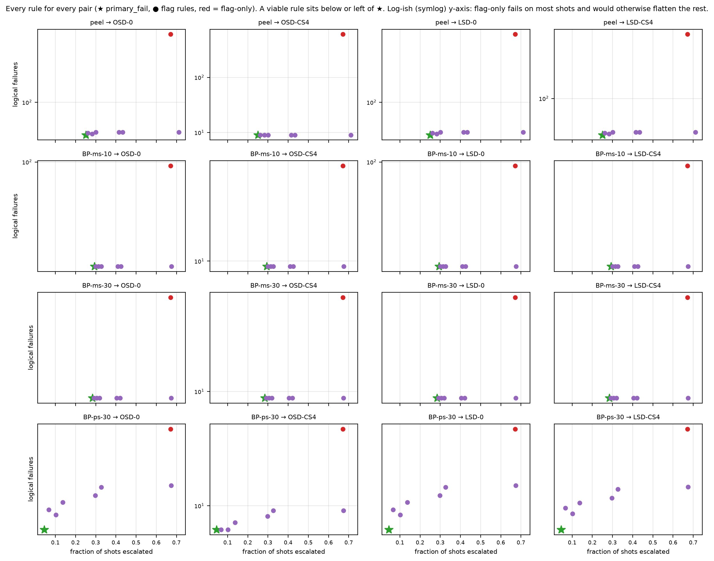

# Experiment 6 decoder zoo — 20,000 shots

Data file: `EXP6_72-12-6_T6_p0.001_20000shots_seed20260922.npz`  
Exported: 2026-09-28T03:41:28

Verdict counts: not viable: 9, viable: cost: 7

## Table: verdicts

[verdicts.csv](verdicts.csv) — 16 rows

| weak | strong | verdict | verdict_accuracy | verdict_cost | headroom | min_detectable_discordant | pf_failures | pf_escalation | pf_cost_us | always_failures | best_accuracy_rule | best_cost_rule | best_saving | cost_ratio |
|---|---|---|---|---|---|---|---|---|---|---|---|---|---|---|
| peel | OSD-0 | not viable | impossible: no headroom | not viable | 0 | 6 | 41 | 0.2505 | 814.7 | 44 | None | None | 0 | 0.01864 |
| peel | OSD-CS4 | not viable | impossible: no headroom | not viable | 0 | 6 | 9 | 0.2505 | 6494 | 9 | None | None | -0.04346 | 0.01717 |
| peel | LSD-0 | not viable | impossible: no headroom | not viable | 0 | 6 | 41 | 0.2505 | 776.3 | 44 | None | None | 0 | 0.01872 |
| peel | LSD-CS4 | not viable | impossible: no headroom | not viable | 0 | 6 | 35 | 0.2505 | 806.7 | 38 | None | None | 0 | 0.01871 |
| BP-ms-10 | OSD-0 | viable: cost | impossible: no headroom | viable: cost | 0 | 6 | 44 | 0.2933 | 2101 | 44 | None | flag>=1 | 0.2067 | 1.022 |
| BP-ms-10 | OSD-CS4 | not viable | impossible: no headroom | not viable | 0 | 6 | 9 | 0.2933 | 1.396e+04 | 9 | None | None | 0.02979 | 0.941 |
| BP-ms-10 | LSD-0 | viable: cost | impossible: no headroom | viable: cost | 0 | 6 | 44 | 0.2933 | 1999 | 44 | None | flag>=1 | 0.2163 | 1.026 |
| BP-ms-10 | LSD-CS4 | viable: cost | impossible: no headroom | viable: cost | 0 | 6 | 38 | 0.2933 | 2058 | 38 | None | flag>=1 | 0.2117 | 1.026 |
| BP-ms-30 | OSD-0 | viable: cost | impossible: no headroom | viable: cost | 0 | 6 | 44 | 0.2842 | 2712 | 44 | None | flag>=1 | 0.3841 | 1.016 |
| BP-ms-30 | OSD-CS4 | viable: cost | impossible: no headroom | viable: cost | 0 | 6 | 9 | 0.2842 | 1.457e+04 | 9 | None | flag>=1 | 0.07019 | 0.9354 |
| BP-ms-30 | LSD-0 | viable: cost | impossible: no headroom | viable: cost | 0 | 6 | 44 | 0.2842 | 2609 | 44 | None | flag>=1 | 0.3984 | 1.02 |
| BP-ms-30 | LSD-CS4 | viable: cost | impossible: no headroom | viable: cost | 0 | 6 | 38 | 0.2842 | 2668 | 38 | None | flag>=1 | 0.3909 | 1.019 |
| BP-ps-30 | OSD-0 | not viable | impossible: no headroom | not viable | 0 | 6 | 26 | 0.0451 | 3437 | 44 | None | None | 0 | 2.846 |
| BP-ps-30 | OSD-CS4 | not viable | impossible: no headroom | not viable | 0 | 6 | 6 | 0.0451 | 5181 | 9 | None | None | -0.1001 | 2.621 |
| BP-ps-30 | LSD-0 | not viable | impossible: no headroom | not viable | 0 | 6 | 26 | 0.0451 | 3430 | 44 | None | None | 0 | 2.859 |
| BP-ps-30 | LSD-CS4 | not viable | impossible: no headroom | not viable | 0 | 6 | 22 | 0.0451 | 3439 | 38 | None | None | 0 | 2.857 |

## Table: weak_decoders

[weak_decoders.csv](weak_decoders.csv) — 4 rows

| weak | converged | silent | silent_rate | silent_rate_upper | silent_on_flagged | median_time_us |
|---|---|---|---|---|---|---|
| peel | 14990 | 0 | 0 | 0.0002562 | 0 | 11.3 |
| BP-ms-10 | 14134 | 0 | 0 | 0.0002717 | 0 | 619.4 |
| BP-ms-30 | 14316 | 0 | 0 | 0.0002683 | 0 | 615.7 |
| BP-ps-30 | 19098 | 0 | 0 | 0.0002011 | 0 | 1725 |

## Table: all_rules

[all_rules.csv](all_rules.csv) — 128 rows

## Table: flag_diagnostics

[flag_diagnostics.csv](flag_diagnostics.csv) — 8 rows

| decoder | flagged_fraction | error_rate_flagged | error_rate_unflagged | risk_ratio | mutual_information_bits | share_of_failures_on_flagged |
|---|---|---|---|---|---|---|
| peel | 0.6711 | 0.2587 | 0.09074 | 2.851 | 0.03092 | 0.8533 |
| BP-ms-10 | 0.6711 | 0.3017 | 0.008056 | 37.45 | 0.117 | 0.9871 |
| BP-ms-30 | 0.6711 | 0.2921 | 0.00532 | 54.9 | 0.1169 | 0.9912 |
| BP-ps-30 | 0.6711 | 0.04761 | 0.006384 | 7.458 | 0.01066 | 0.9383 |
| OSD-0 | 0.6711 | 0.003278 | 0 | inf | 0.001268 | 1 |
| OSD-CS4 | 0.6711 | 0.0006706 | 0 | inf | 0.0002591 | 1 |
| LSD-0 | 0.6711 | 0.003278 | 0 | inf | 0.001268 | 1 |
| LSD-CS4 | 0.6711 | 0.002831 | 0 | inf | 0.001095 | 1 |

## Table: strong_ceiling

[strong_ceiling.csv](strong_ceiling.csv) — 12 rows

| decoder | compared_with | failures | fixed_by_other | broken_by_other |
|---|---|---|---|---|
| OSD-0 | OSD-CS4 | 44 | 35 | 0 |
| OSD-0 | LSD-0 | 44 | 0 | 0 |
| OSD-0 | LSD-CS4 | 44 | 6 | 0 |
| OSD-CS4 | OSD-0 | 9 | 0 | 35 |
| OSD-CS4 | LSD-0 | 9 | 0 | 35 |
| OSD-CS4 | LSD-CS4 | 9 | 0 | 29 |
| LSD-0 | OSD-0 | 44 | 0 | 0 |
| LSD-0 | OSD-CS4 | 44 | 35 | 0 |
| LSD-0 | LSD-CS4 | 44 | 6 | 0 |
| LSD-CS4 | OSD-0 | 38 | 0 | 6 |
| LSD-CS4 | OSD-CS4 | 38 | 29 | 0 |
| LSD-CS4 | LSD-0 | 38 | 0 | 6 |

## Figure: verdicts

  
Vector version: [verdicts.pdf](verdicts.pdf)

## Figure: silent_failures

  
Vector version: [silent_failures.pdf](silent_failures.pdf)

## Figure: breakeven

  
Vector version: [breakeven.pdf](breakeven.pdf)

## Figure: tradeoffs

  
Vector version: [tradeoffs.pdf](tradeoffs.pdf)
