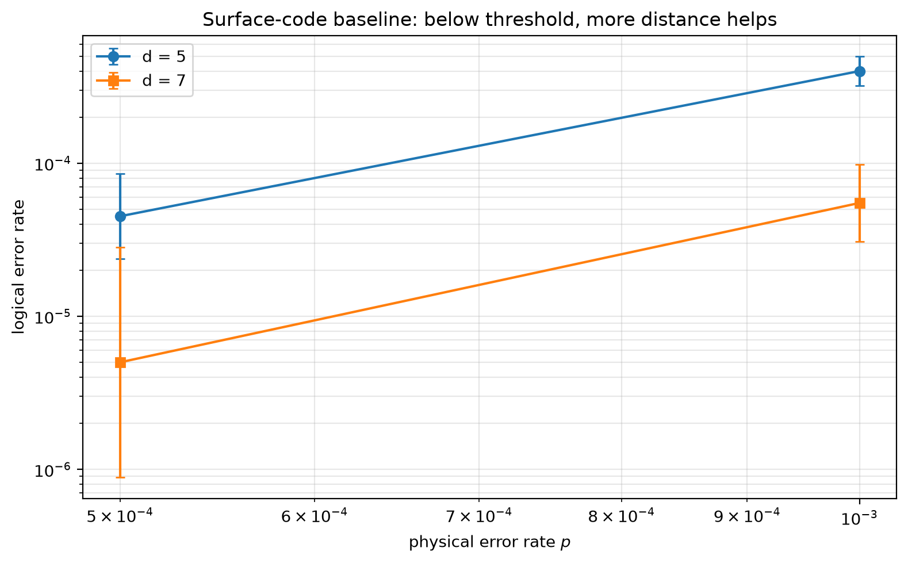

# Experiment 7 surface-code baseline — T=6, 200000 shots/point

Data file: `EXP7_surface_T6_200000shots_seed20260929_osd0.json`  
Exported: 2026-09-30T12:19:14

No crossing in range.

## Table: points

[points.csv](points.csv) — 4 rows

| distance | rounds | p | shots | seed | osd_order | failures | ler | ci_low | ci_high | detectors | faults | qubits | time_p50_us |
|---|---|---|---|---|---|---|---|---|---|---|---|---|---|
| 5 | 6 | 0.0005 | 200000 | 20260929 | 0 | 9 | 4.5e-05 | 2.368e-05 | 8.553e-05 | 144 | 2085 | 64 | 20 |
| 5 | 6 | 0.001 | 200000 | 20260929 | 0 | 80 | 0.0004 | 0.0003214 | 0.0004978 | 144 | 2085 | 64 | 292.9 |
| 7 | 6 | 0.0005 | 200000 | 20260929 | 0 | 1 | 5e-06 | 8.826e-07 | 2.832e-05 | 288 | 4583 | 118 | 682 |
| 7 | 6 | 0.001 | 200000 | 20260929 | 0 | 11 | 5.5e-05 | 3.071e-05 | 9.849e-05 | 288 | 4583 | 118 | 859.9 |

## Figure: surface_sweep

  
Vector version: [surface_sweep.pdf](surface_sweep.pdf)
