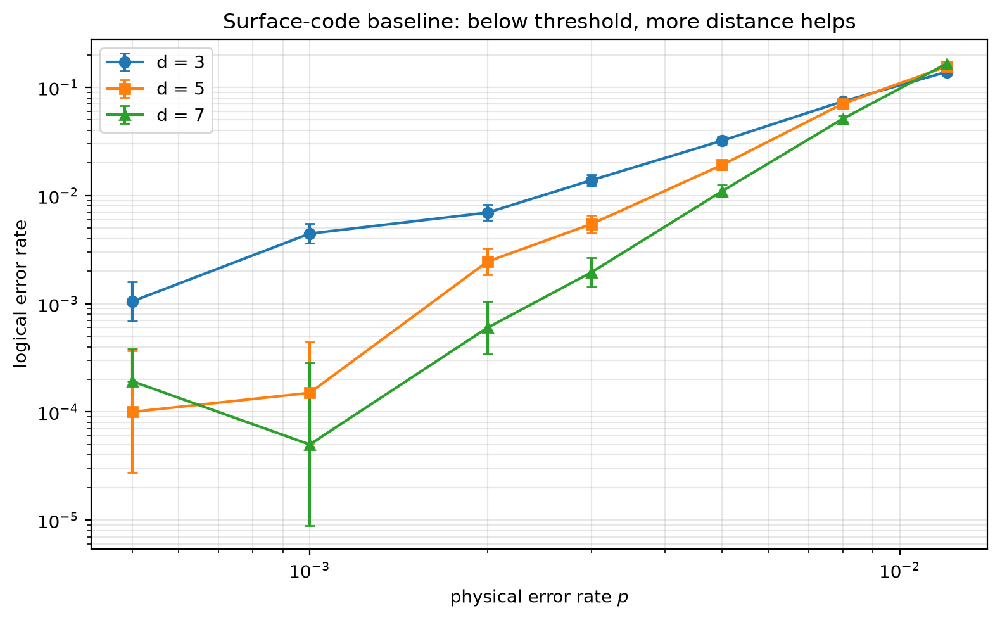

# Experiment 7 surface-code baseline — T=6, 20000 shots/point

Data file: `EXP7_surface_T6_20000shots_seed20260929_osd0.json`  
Exported: 2026-09-29T20:29:01

Threshold estimate: 1.067e-02

## Table: points

[points.csv](points.csv) — 21 rows

| distance | rounds | p | shots | seed | osd_order | failures | ler | ci_low | ci_high | detectors | faults | qubits | time_p50_us |
|---|---|---|---|---|---|---|---|---|---|---|---|---|---|
| 3 | 6 | 0.0005 | 20000 | 20260929 | 0 | 21 | 0.00105 | 0.0006869 | 0.001605 | 48 | 555 | 26 | 7.8 |
| 3 | 6 | 0.001 | 20000 | 20260929 | 0 | 89 | 0.00445 | 0.003618 | 0.005472 | 48 | 555 | 26 | 8.1 |
| 3 | 6 | 0.002 | 20000 | 20260929 | 0 | 139 | 0.00695 | 0.00589 | 0.0082 | 48 | 555 | 26 | 11 |
| 3 | 6 | 0.003 | 20000 | 20260929 | 0 | 277 | 0.01385 | 0.01232 | 0.01557 | 48 | 555 | 26 | 77.6 |
| 3 | 6 | 0.005 | 20000 | 20260929 | 0 | 644 | 0.0322 | 0.02984 | 0.03474 | 48 | 555 | 26 | 94.8 |
| 3 | 6 | 0.008 | 20000 | 20260929 | 0 | 1483 | 0.07415 | 0.0706 | 0.07786 | 48 | 555 | 26 | 322.7 |
| 3 | 6 | 0.012 | 20000 | 20260929 | 0 | 2779 | 0.1389 | 0.1342 | 0.1438 | 48 | 555 | 26 | 393.9 |
| 5 | 6 | 0.0005 | 20000 | 20260929 | 0 | 2 | 0.0001 | 2.742e-05 | 0.0003646 | 144 | 2085 | 64 | 20.1 |
| 5 | 6 | 0.001 | 20000 | 20260929 | 0 | 3 | 0.00015 | 5.101e-05 | 0.000441 | 144 | 2085 | 64 | 303.2 |
| 5 | 6 | 0.002 | 20000 | 20260929 | 0 | 49 | 0.00245 | 0.001854 | 0.003237 | 144 | 2085 | 64 | 411.6 |
| 5 | 6 | 0.003 | 20000 | 20260929 | 0 | 109 | 0.00545 | 0.00452 | 0.00657 | 144 | 2085 | 64 | 480.7 |
| 5 | 6 | 0.005 | 20000 | 20260929 | 0 | 384 | 0.0192 | 0.01739 | 0.0212 | 144 | 2085 | 64 | 1451 |
| 5 | 6 | 0.008 | 20000 | 20260929 | 0 | 1411 | 0.07055 | 0.06708 | 0.07418 | 144 | 2085 | 64 | 2081 |
| 5 | 6 | 0.012 | 20000 | 20260929 | 0 | 3117 | 0.1558 | 0.1509 | 0.1609 | 144 | 2085 | 64 | 2143 |
| 7 | 6 | 0.0005 | 20000 | 20260929 | 0 | 0 | 0 | 0 | 0.000192 | 288 | 4583 | 118 | 698 |
| 7 | 6 | 0.001 | 20000 | 20260929 | 0 | 1 | 5e-05 | 8.826e-06 | 0.0002832 | 288 | 4583 | 118 | 993 |
| 7 | 6 | 0.002 | 20000 | 20260929 | 0 | 12 | 0.0006 | 0.0003433 | 0.001049 | 288 | 4583 | 118 | 1730 |
| 7 | 6 | 0.003 | 20000 | 20260929 | 0 | 39 | 0.00195 | 0.001427 | 0.002664 | 288 | 4583 | 118 | 4269 |
| 7 | 6 | 0.005 | 20000 | 20260929 | 0 | 220 | 0.011 | 0.009645 | 0.01254 | 288 | 4583 | 118 | 4987 |
| 7 | 6 | 0.008 | 20000 | 20260929 | 0 | 1024 | 0.0512 | 0.04823 | 0.05434 | 288 | 4583 | 118 | 5914 |
| 7 | 6 | 0.012 | 20000 | 20260929 | 0 | 3310 | 0.1655 | 0.1604 | 0.1707 | 288 | 4583 | 118 | 5483 |

## Figure: surface_sweep

  
Vector version: [surface_sweep.pdf](surface_sweep.pdf)
