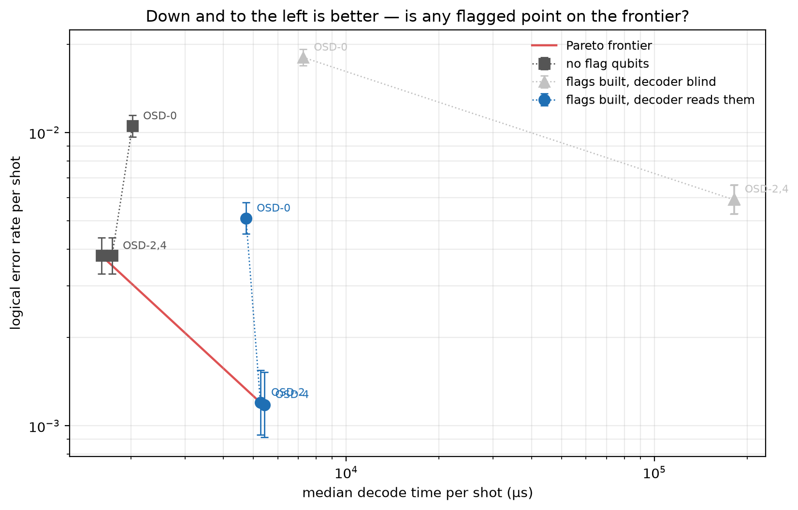

# Experiment 8 accuracy/latency frontier — [[72, 12, 6]], T=12, p=0.001

Data file: `EXP8_72-12-6_T12_p0.001_50000shots_seed20260930.json`  
Exported: 2026-09-30T06:21:17

flags are on the frontier

## Table: points

[points.csv](points.csv) — 9 rows

| arm | osd_order | code | rounds | p | shots | seed | failures | ler | ci_low | ci_high | time_p50_us | time_p99_us | bp_iters | detectors | faults | qubits |
|---|---|---|---|---|---|---|---|---|---|---|---|---|---|---|---|---|
| unflagged | 0 | [[72, 12, 6]] | 12 | 0.001 | 50000 | 20260930 | 526 | 0.01052 | 0.009663 | 0.01145 | 2024 | 1.209e+04 | 8.724 | 468 | 4392 | 144 |
| unflagged | 2 | [[72, 12, 6]] | 12 | 0.001 | 50000 | 20260930 | 190 | 0.0038 | 0.003297 | 0.004379 | 1606 | 1.355e+05 | 8.724 | 468 | 4392 | 144 |
| unflagged | 4 | [[72, 12, 6]] | 12 | 0.001 | 50000 | 20260930 | 190 | 0.0038 | 0.003297 | 0.004379 | 1740 | 1.391e+05 | 8.724 | 468 | 4392 | 144 |
| blind | 0 | [[72, 12, 6]] | 12 | 0.001 | 50000 | 20260930 | 902 | 0.01804 | 0.01691 | 0.01924 | 7246 | 1.208e+04 | 18.4 | 468 | 5688 | 180 |
| blind | 2 | [[72, 12, 6]] | 12 | 0.001 | 50000 | 20260930 | 296 | 0.00592 | 0.005284 | 0.006631 | 1.812e+05 | 2.31e+05 | 18.4 | 468 | 5688 | 180 |
| blind | 4 | [[72, 12, 6]] | 12 | 0.001 | 50000 | 20260930 | 295 | 0.0059 | 0.005266 | 0.00661 | 1.808e+05 | 2.281e+05 | 18.4 | 468 | 5688 | 180 |
| sighted | 0 | [[72, 12, 6]] | 12 | 0.001 | 50000 | 20260930 | 255 | 0.0051 | 0.004513 | 0.005764 | 4731 | 1.098e+04 | 11.76 | 900 | 5688 | 180 |
| sighted | 2 | [[72, 12, 6]] | 12 | 0.001 | 50000 | 20260930 | 60 | 0.0012 | 0.0009325 | 0.001544 | 5268 | 2.371e+05 | 11.76 | 900 | 5688 | 180 |
| sighted | 4 | [[72, 12, 6]] | 12 | 0.001 | 50000 | 20260930 | 59 | 0.00118 | 0.000915 | 0.001522 | 5431 | 2.387e+05 | 11.76 | 900 | 5688 | 180 |

## Figure: pareto

  
Vector version: [pareto.pdf](pareto.pdf)
