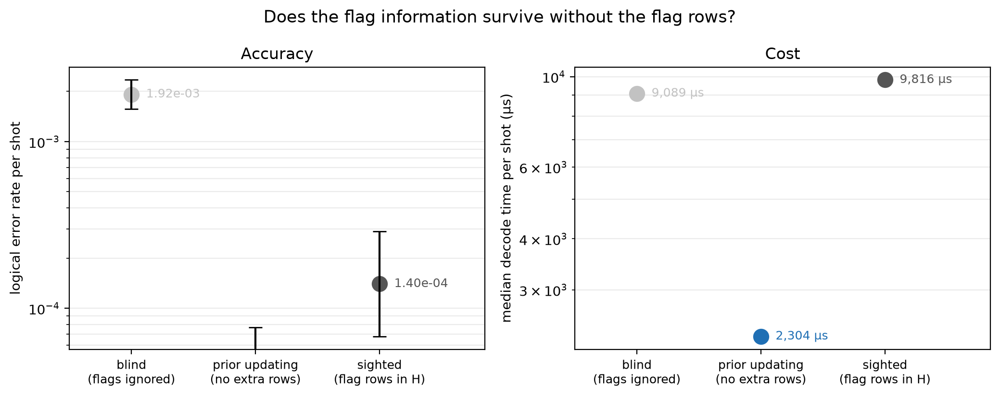

# Experiment 9 dynamic prior updating — [[144, 12, 12]], T=12, p=0.001

Data file: `EXP9_144-12-12_T12_p0.001_50000shots_seed20260930_osd0.json`  
Exported: 2026-09-30T12:10:05

**Prior updating recovers 108% of the gap between the blind and sighted arms**, on a check matrix 936 × 11376 rather than 1800 × 11376 — 1.92× fewer entries.  
It matches the sighted arm within 5%, so the flag rows buy nothing that the exact one-shot posterior does not already capture.

## Table: arms

[arms.csv](arms.csv) — 3 rows

| arm | failures | ler | ci_low | ci_high | time_p50_us | time_p99_us | detectors | faults |
|---|---|---|---|---|---|---|---|---|
| blind | 96 | 0.00192 | 0.001573 | 0.002344 | 9089 | 1.398e+04 | 936 | 11376 |
| updated | 0 | 0 | 0 | 7.683e-05 | 2304 | 1.019e+04 | 936 | 11376 |
| sighted | 7 | 0.00014 | 6.782e-05 | 0.000289 | 9816 | 1.47e+04 | 1800 | 11376 |

## Figure: prior_update

  
Vector version: [prior_update.pdf](prior_update.pdf)
