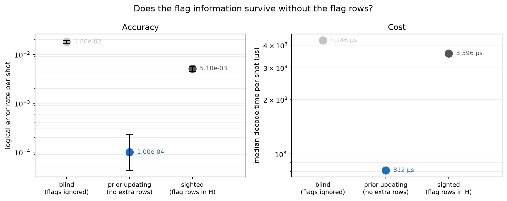

# Experiment 9 dynamic prior updating — [[72, 12, 6]], T=12, p=0.001

Data file: `EXP9_72-12-6_T12_p0.001_50000shots_seed20260930_osd0.json`  
Exported: 2026-09-30T07:35:03

**Prior updating recovers 139% of the gap between the blind and sighted arms**, on a check matrix 468 × 5688 rather than 900 × 5688 — 1.92× fewer entries.  
It matches the sighted arm within 5%, so the flag rows buy nothing that the exact one-shot posterior does not already capture.

## Table: arms

[arms.csv](arms.csv) — 3 rows

| arm | failures | ler | ci_low | ci_high | time_p50_us | time_p99_us | detectors | faults |
|---|---|---|---|---|---|---|---|---|
| blind | 902 | 0.01804 | 0.01691 | 0.01924 | 4246 | 6857 | 468 | 5688 |
| updated | 5 | 0.0001 | 4.271e-05 | 0.0002341 | 811.8 | 4853 | 468 | 5688 |
| sighted | 255 | 0.0051 | 0.004513 | 0.005764 | 3596 | 7205 | 900 | 5688 |

## Figure: prior_update

  
Vector version: [prior_update.pdf](prior_update.pdf)
