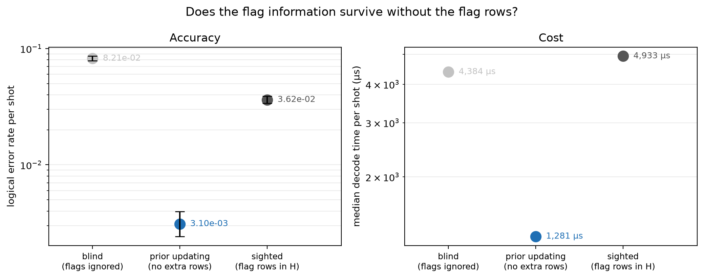

# Experiment 9 dynamic prior updating — [[72, 12, 6]], T=12, p=0.002

Data file: `EXP9_72-12-6_T12_p0.002_20000shots_seed20260930_osd0.json`  
Exported: 2026-09-30T12:14:52

**Prior updating recovers 172% of the gap between the blind and sighted arms**, on a check matrix 468 × 5688 rather than 900 × 5688 — 1.92× fewer entries.  
It matches the sighted arm within 5%, so the flag rows buy nothing that the exact one-shot posterior does not already capture.

## Table: arms

[arms.csv](arms.csv) — 3 rows

| arm | failures | ler | ci_low | ci_high | time_p50_us | time_p99_us | detectors | faults |
|---|---|---|---|---|---|---|---|---|
| blind | 1642 | 0.0821 | 0.07838 | 0.08599 | 4384 | 8377 | 468 | 5688 |
| updated | 62 | 0.0031 | 0.002419 | 0.003972 | 1281 | 5454 | 468 | 5688 |
| sighted | 725 | 0.03625 | 0.03375 | 0.03893 | 4933 | 8442 | 900 | 5688 |

## Figure: prior_update

  
Vector version: [prior_update.pdf](prior_update.pdf)
