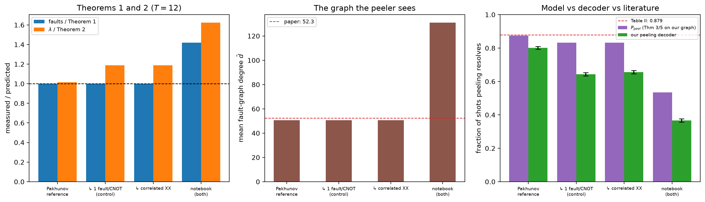

# Pakhunov reference model — [[144, 12, 12]], p=0.001, T=12

Data file: `PK_144-12-12_T12_p0.001_10000shots.json`  
Exported: 2026-09-30T03:29:55

**The model reproduces the literature.** On the reference circuit the Theorem 3/5 prediction evaluated on our own measured graph is 0.874 against Table II's 0.879. Our decoder then resolves 0.801, so the residual **+0.073** is our peeling implementation, not the physics.

## Table: variants

[variants.csv](variants.csv) — 4 rows

| variant | rounds | p | code | detectors | faults | theory_faults | fault_ratio | lam | theory_lambda | lambda_ratio | mean_degree | a0 | theory_peel | peel | peel_lo | peel_hi | uniform_weight | shots | column_weight | cnot | meas_faults | boundary |
|---|---|---|---|---|---|---|---|---|---|---|---|---|---|---|---|---|---|---|---|---|---|---|
| Pakhunov reference | 12 | 0.001 | [[144, 12, 12]] | 936 | 6192 | 6192 | 1 | 6.154 | 6.057 | 1.016 | 50.56 | 0.869 | 0.8743 | 0.8013 | 0.7934 | 0.809 | True | 10000 | 3 | 5184 | 864 | 144 |
|   .. 1 fault/CNOT (control) | 12 | 0.001 | [[144, 12, 12]] | 936 | 6192 | 6192 | 1 | 7.198 | 6.057 | 1.188 | 50.56 | 0.869 | 0.8321 | 0.6433 | 0.6339 | 0.6526 | True | 10000 | 3 | 5184 | 864 | 144 |
|   .. correlated XX | 12 | 0.001 | [[144, 12, 12]] | 936 | 6192 | 6192 | 1 | 7.198 | 6.057 | 1.188 | 50.56 | 0.869 | 0.8321 | 0.6559 | 0.6465 | 0.6651 | True | 10000 | 3 | 5184 | 864 | 144 |
| notebook (both check families) | 12 | 0.001 | [[144, 12, 12]] | 936 | 8784 | 6192 | 1.419 | 9.836 | 6.057 | 1.624 | 131 | 0.869 | 0.5342 | 0.3665 | 0.3571 | 0.376 | True | 10000 | 3 | 5184 | 864 | 144 |

## Figure: variants

  
Vector version: [variants.pdf](variants.pdf)
