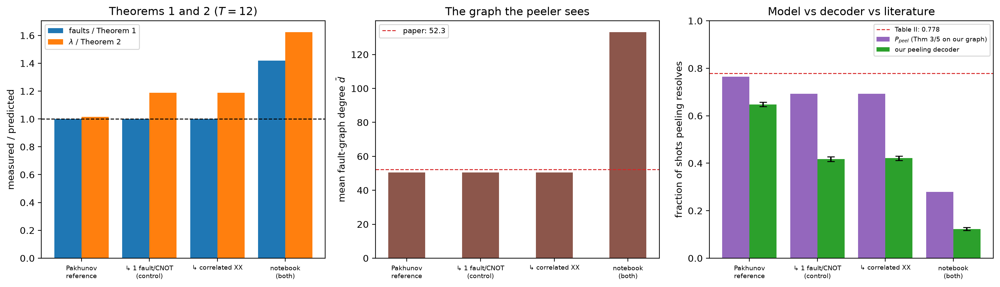

# Pakhunov reference model — [[288, 12, 18]], p=0.001, T=12

Data file: `PK_288-12-18_T12_p0.001_10000shots.json`  
Exported: 2026-09-30T03:33:18

**The model reproduces the literature.** On the reference circuit the Theorem 3/5 prediction evaluated on our own measured graph is 0.764 against Table II's 0.778. Our decoder then resolves 0.648, so the residual **+0.117** is our peeling implementation, not the physics.

## Table: variants

[variants.csv](variants.csv) — 4 rows

| variant | rounds | p | code | detectors | faults | theory_faults | fault_ratio | lam | theory_lambda | lambda_ratio | mean_degree | a0 | theory_peel | peel | peel_lo | peel_hi | uniform_weight | shots | column_weight | cnot | meas_faults | boundary |
|---|---|---|---|---|---|---|---|---|---|---|---|---|---|---|---|---|---|---|---|---|---|---|
| Pakhunov reference | 12 | 0.001 | [[288, 12, 18]] | 1872 | 12384 | 12384 | 1 | 12.31 | 12.11 | 1.016 | 50.56 | 0.869 | 0.7643 | 0.6477 | 0.6383 | 0.657 | True | 10000 | 3 | 10368 | 1728 | 288 |
|   .. 1 fault/CNOT (control) | 12 | 0.001 | [[288, 12, 18]] | 1872 | 12384 | 12384 | 1 | 14.4 | 12.11 | 1.188 | 50.56 | 0.869 | 0.6924 | 0.4176 | 0.408 | 0.4273 | True | 10000 | 3 | 10368 | 1728 | 288 |
|   .. correlated XX | 12 | 0.001 | [[288, 12, 18]] | 1872 | 12384 | 12384 | 1 | 14.4 | 12.11 | 1.188 | 50.56 | 0.869 | 0.6924 | 0.421 | 0.4114 | 0.4307 | True | 10000 | 3 | 10368 | 1728 | 288 |
| notebook (both check families) | 12 | 0.001 | [[288, 12, 18]] | 1872 | 17568 | 12384 | 1.419 | 19.67 | 12.11 | 1.624 | 133.2 | 0.869 | 0.2795 | 0.123 | 0.1167 | 0.1296 | True | 10000 | 3 | 10368 | 1728 | 288 |

## Figure: variants

  
Vector version: [variants.pdf](variants.pdf)
