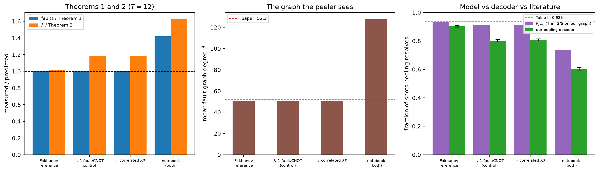

# Pakhunov reference model — [[72, 12, 6]], p=0.001, T=12

Data file: `PK_72-12-6_T12_p0.001_10000shots.json`  
Exported: 2026-09-30T03:29:11

**The model reproduces the literature.** On the reference circuit the Theorem 3/5 prediction evaluated on our own measured graph is 0.935 against Table II's 0.935. Our decoder then resolves 0.903, so the residual **+0.032** is our peeling implementation, not the physics.

## Table: variants

[variants.csv](variants.csv) — 4 rows

| variant | rounds | p | code | detectors | faults | theory_faults | fault_ratio | lam | theory_lambda | lambda_ratio | mean_degree | a0 | theory_peel | peel | peel_lo | peel_hi | uniform_weight | shots | column_weight | cnot | meas_faults | boundary |
|---|---|---|---|---|---|---|---|---|---|---|---|---|---|---|---|---|---|---|---|---|---|---|
| Pakhunov reference | 12 | 0.001 | [[72, 12, 6]] | 468 | 3096 | 3096 | 1 | 3.077 | 3.028 | 1.016 | 50.56 | 0.869 | 0.935 | 0.9028 | 0.8968 | 0.9085 | True | 10000 | 3 | 2592 | 432 | 72 |
|   .. 1 fault/CNOT (control) | 12 | 0.001 | [[72, 12, 6]] | 468 | 3096 | 3096 | 1 | 3.599 | 3.028 | 1.188 | 50.56 | 0.869 | 0.9122 | 0.8018 | 0.7939 | 0.8095 | True | 10000 | 3 | 2592 | 432 | 72 |
|   .. correlated XX | 12 | 0.001 | [[72, 12, 6]] | 468 | 3096 | 3096 | 1 | 3.599 | 3.028 | 1.188 | 50.56 | 0.869 | 0.9122 | 0.8075 | 0.7997 | 0.8151 | True | 10000 | 3 | 2592 | 432 | 72 |
| notebook (both check families) | 12 | 0.001 | [[72, 12, 6]] | 468 | 4392 | 3096 | 1.419 | 4.918 | 3.028 | 1.624 | 127.7 | 0.869 | 0.7368 | 0.6051 | 0.5955 | 0.6146 | True | 10000 | 3 | 2592 | 432 | 72 |

## Figure: variants

  
Vector version: [variants.pdf](variants.pdf)
