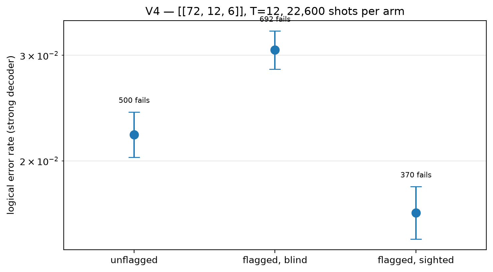

# V4 hardening vs information — [[72, 12, 6]]

Data file: `V4_72-12-6_T12_p0.001_22600shots.json`  
Exported: 2026-09-23T19:41:44

**Both contribute**: blind sits between unflagged and sighted, with all three separated.

## Table: arms

[arms.csv](arms.csv) — 3 rows

| arm | failures | ler | ci_low | ci_high | detectors | faults |
|---|---|---|---|---|---|---|
| unflagged | 500 | 0.02212 | 0.02029 | 0.02412 | 864 | 33552 |
| flagged, blind | 692 | 0.03062 | 0.02845 | 0.03295 | 864 | 36144 |
| flagged, sighted | 370 | 0.01637 | 0.0148 | 0.01811 | 1296 | 36144 |

## Figure: v4_arms

  
Vector version: [v4_arms.pdf](v4_arms.pdf)
