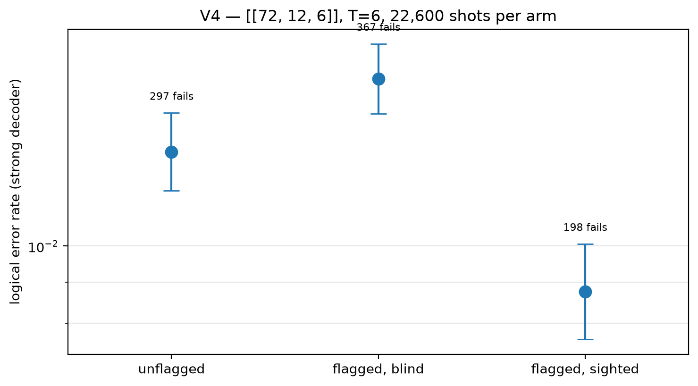

# V4 hardening vs information — [[72, 12, 6]]

Data file: `V4_72-12-6_T6_p0.001_22600shots.json`  
Exported: 2026-09-23T21:35:18

**Extra information.** Blind decoding falls back to the unflagged rate, so the gain comes from the decoder reading the flag detectors, not from the circuit.

## Table: arms

[arms.csv](arms.csv) — 3 rows

| arm | failures | ler | ci_low | ci_high | detectors | faults |
|---|---|---|---|---|---|---|
| unflagged | 297 | 0.01314 | 0.01174 | 0.01471 | 432 | 15840 |
| flagged, blind | 367 | 0.01624 | 0.01467 | 0.01797 | 432 | 17136 |
| flagged, sighted | 198 | 0.008761 | 0.007627 | 0.01006 | 648 | 17136 |

## Figure: v4_arms

  
Vector version: [v4_arms.pdf](v4_arms.pdf)
