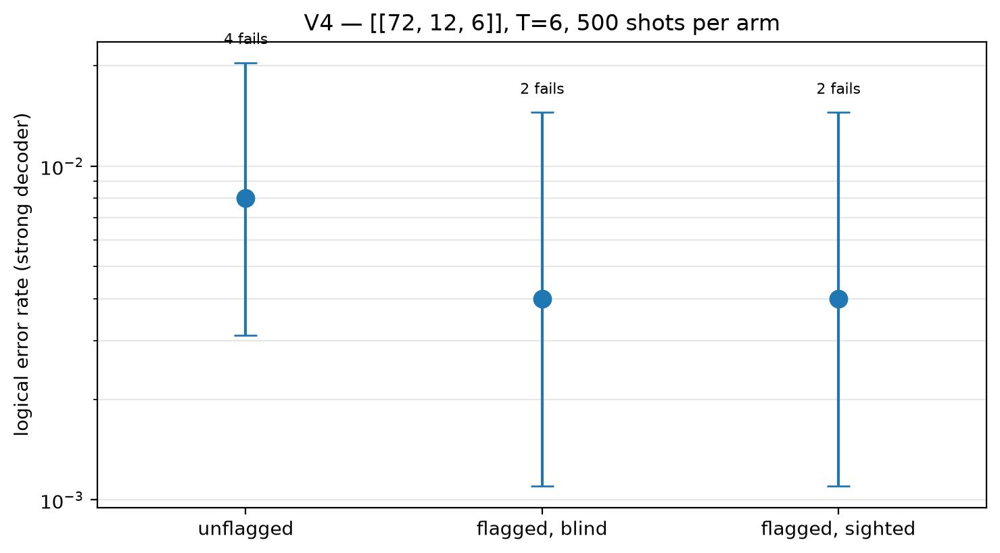

# V4 hardening vs information — [[72, 12, 6]]

Data file: `V4_72-12-6_T6_p0.001_500shots.json`  
Exported: 2026-09-23T21:13:24

**Inconclusive** — the three arms overlap. Run more shots.

## Table: arms

[arms.csv](arms.csv) — 3 rows

| arm | failures | ler | ci_low | ci_high | detectors | faults |
|---|---|---|---|---|---|---|
| unflagged | 4 | 0.008 | 0.003115 | 0.02039 | 432 | 15840 |
| flagged, blind | 2 | 0.004 | 0.001098 | 0.01447 | 432 | 17136 |
| flagged, sighted | 2 | 0.004 | 0.001098 | 0.01447 | 648 | 17136 |

## Figure: v4_arms

  
Vector version: [v4_arms.pdf](v4_arms.pdf)
