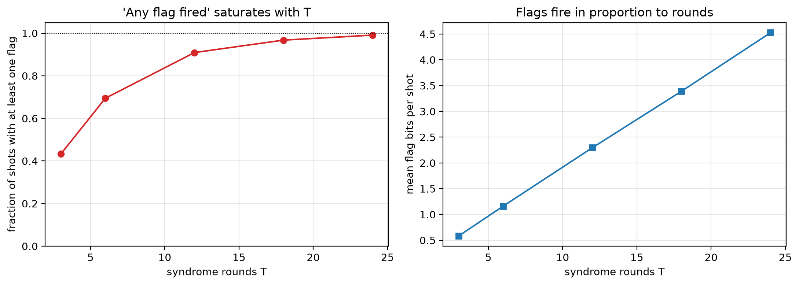

# V5 flag rate vs rounds — [[72, 12, 6]], p=0.001

Data file: `V5_72-12-6_p0.001_flagrate.json`  
Exported: 2026-09-23T21:37:06

A trigger that fires on nearly every shot cannot discriminate; this is the mechanism behind a null result for flag triggering.

## Table: flag_rate

[flag_rate.csv](flag_rate.csv) — 5 rows

| rounds | flag_detectors | fraction_any_flag | mean_flags_per_shot |
|---|---|---|---|
| 3 | 108 | 0.4325 | 0.5825 |
| 6 | 216 | 0.6945 | 1.161 |
| 12 | 432 | 0.909 | 2.294 |
| 18 | 648 | 0.9675 | 3.389 |
| 24 | 864 | 0.991 | 4.526 |

## Figure: v5_flag_rate

  
Vector version: [v5_flag_rate.pdf](v5_flag_rate.pdf)
